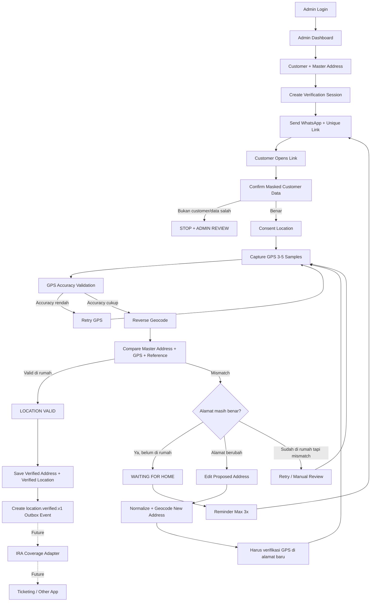
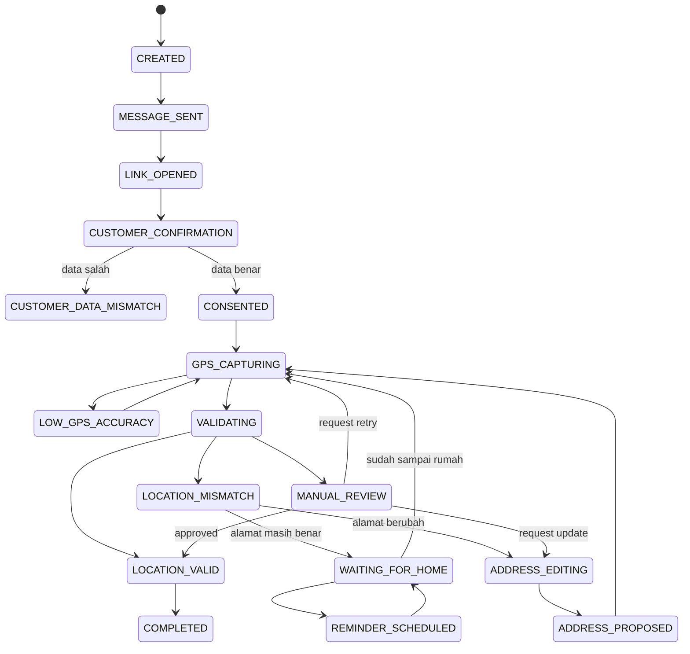
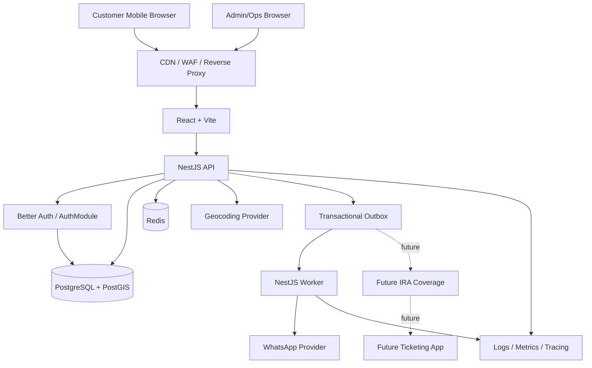
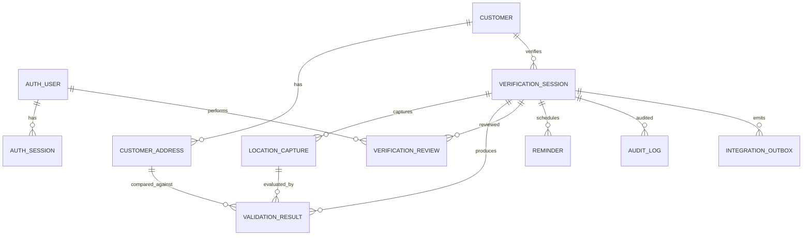

# PRD — IRA Preregist

**Versi:** 0.6  
**Status:** Draft untuk Product & Technical Review  
**Fokus rilis saat ini:** Validasi customer, alamat, keberadaan di rumah/lokasi pemasangan, exact GPS lat/lng + accuracy, reminder, dan Admin/Ops review  
**Future-ready:** IRA Coverage dan Ticketing Integration  
**Platform:** Customer Mobile Web + Admin/Ops Web  
**Primary Stack:** React, Vite, TanStack, NestJS, Better Auth, Drizzle ORM, PostgreSQL + PostGIS  

---

# 1. Ringkasan Produk

Aplikasi ini bertujuan memastikan bahwa customer yang akan diproses untuk pemasangan memiliki **alamat dan lokasi pemasangan yang akurat**, serta customer melakukan verifikasi **ketika benar-benar berada di rumah/lokasi pemasangan**.

Fokus MVP bukan ticketing dan bukan pengecekan coverage IRA secara aktif. Fokus MVP adalah menghasilkan data berikut dengan tingkat keyakinan tinggi:

```text
Customer yang benar
        +
Alamat yang benar
        +
GPS yang cukup akurat
        +
Customer berada di area rumah/lokasi pemasangan
        =
VERIFIED LOCATION
```

Setelah `LOCATION_VALID`, data harus disimpan dengan struktur yang siap digunakan oleh integrasi lain di masa depan.

```text
LOCATION_VALID
      │
      ├── Future: IRA Coverage Integration
      │
      └── Future: Ticketing / Work Order Integration
```

Coverage IRA dan ticketing **tidak menjadi dependency MVP**. Sistem hanya menyiapkan adapter/port, integration event, feature flag, dan transactional outbox agar integrasi dapat ditambahkan tanpa merombak core validation.

---

# 2. Perubahan Utama dari Versi Sebelumnya

Versi ini memperjelas beberapa keputusan produk:

1. **Admin/Ops wajib login.**
2. Authentication Admin menggunakan **Better Auth**.
3. Database access menggunakan **Drizzle ORM**.
4. Customer **tidak perlu membuat akun/login**; customer mengakses unique verification link yang dikirim ke nomor terdaftar.
5. Admin dapat melihat dan melakukan review terhadap customer, alamat, GPS, validation result, reminder history, dan proposed address.
6. Core MVP berakhir pada **verified customer location**.
7. **IRA Coverage belum diintegrasikan pada MVP sekarang.**
8. **Ticketing belum diintegrasikan pada MVP sekarang.**
9. Sistem tetap menyiapkan integration boundary untuk keduanya.
10. Reminder ke customer dibatasi **maksimal 3 kali per verification session**.
11. Hasil GPS wajib menghasilkan **latitude + longitude yang eksplisit**, accuracy dalam meter, timestamp, dan link yang dapat dibuka langsung di Maps oleh Admin/Ops.
12. Admin dapat membandingkan titik GPS customer dengan reference home location melalui map, accuracy circle, dan jarak antar titik.

---

# 3. Product Goals

## 3.1 Business Goals

- Mendapatkan exact coordinate rumah/lokasi pemasangan customer.
- Memastikan customer melakukan verifikasi dari area rumah/lokasi pemasangan.
- Mencocokkan GPS customer dengan data alamat yang sudah dimiliki perusahaan.
- Memperbaiki kualitas data alamat apabila customer sudah pindah.
- Mencegah data lokasi yang diambil ketika customer berada di kantor, perjalanan, atau lokasi lain dianggap valid.
- Menyediakan Admin/Ops dashboard untuk melakukan monitoring dan review.
- Mengurangi validasi manual melalui WhatsApp/chat.
- Membuat data verified location siap dipakai oleh IRA Coverage dan Ticketing di masa depan.

## 3.2 Technical Goals

- Core validation independen dari provider eksternal.
- Authentication Admin terpisah dari customer verification flow.
- Seluruh business threshold configurable.
- Seluruh keputusan validation memiliki reason code dan audit trail.
- Spatial calculation menggunakan PostgreSQL + PostGIS.
- Database access menggunakan Drizzle ORM.
- Future integration memakai explicit contract, bukan shared database.

---

# 4. Scope

## 4.1 Scope MVP — Dikerjakan Sekarang

### Admin/Ops

- Login page.
- Logout.
- Session authentication.
- Role-based authorization.
- Dashboard.
- Customer list/search.
- Customer detail.
- Melihat master address.
- Melihat verification session.
- Melihat GPS capture.
- Melihat **latitude, longitude, accuracy (meter), capture time, dan koordinat siap copy**.
- Membuka titik GPS customer secara langsung melalui tombol **Open in Google Maps**.
- Melihat marker GPS customer, marker reference rumah, accuracy circle, dan garis/jarak antar titik.
- Melihat distance, accuracy, address score, dan reason code.
- Melihat reminder history.
- Melihat proposed address.
- Melakukan manual review jika validation engine tidak dapat memutuskan otomatis.
- Approve/reject manual review dengan alasan wajib.
- Membuat/resend verification session sesuai policy.
- Mengatur configurable validation rules.
- Audit trail.

### Customer

- Menerima WhatsApp invitation.
- Membuka unique verification link.
- Konfirmasi bahwa data customer yang ditampilkan memang miliknya.
- Memberikan consent penggunaan lokasi.
- Capture GPS menggunakan mobile browser.
- GPS multi-sample.
- Validasi GPS accuracy.
- Reverse geocoding.
- Pencocokan alamat.
- Home-radius validation.
- Tidak dapat menyelesaikan verifikasi jika belum berada di rumah.
- Memilih `Saya belum di rumah`.
- Mendapat reminder maksimal 3x.
- Setiap reminder memiliki verification link.
- Memilih `Alamat saya sudah berubah`.
- Edit proposed address.
- Re-verification pada alamat baru.
- Success page ketika lokasi sudah valid.

### Platform

- Better Auth untuk Admin/Ops.
- Drizzle ORM.
- PostgreSQL.
- PostGIS.
- Redis + BullMQ untuk reminder/background jobs.
- Notification adapter untuk WhatsApp.
- Geocoding adapter.
- Transactional outbox.
- Generic integration event `location.verified.v1`.
- Feature flag untuk future integrations.

---

## 4.2 Disiapkan Sekarang, Tetapi Belum Diaktifkan

### IRA Coverage

Dipersiapkan:

- interface/port;
- request/response contract draft;
- feature flag;
- integration config;
- outbox/event consumer point;
- status placeholder.

Tidak dikerjakan sekarang:

- actual request ke IRA;
- actual polygon/network calculation milik IRA;
- production coverage result;
- customer-facing covered/not-covered result.

### Ticketing

Dipersiapkan:

- interface/port;
- event contract;
- idempotency key;
- correlation ID;
- integration config;
- integration outbox.

Tidak dikerjakan sekarang:

- create ticket;
- assignment teknisi;
- SLA;
- scheduling;
- ticket lifecycle;
- installation progress;
- ticket closure.

---

## 4.3 Out of Scope MVP

- CRM replacement.
- Billing/payment.
- Installer tracking.
- Route optimization.
- Network planning.
- Customer username/password account.
- Biometric identity verification.
- Native mobile application.
- Actual IRA coverage integration.
- Actual ticketing integration.

---

# 5. User & Access Model

## 5.1 Admin/Ops — Wajib Login

Admin/Ops mengakses:

```text
/login
```

Setelah authenticated:

```text
/dashboard
/customers
/customers/:customerId
/verifications
/verifications/:verificationId
/settings/validation
/audit-logs
```

Semua halaman Admin wajib protected.

### Recommended Roles

```text
SUPER_ADMIN
ADMIN
REVIEWER
VIEWER
```

### Permission Matrix

| Capability | SUPER_ADMIN | ADMIN | REVIEWER | VIEWER |
|---|:---:|:---:|:---:|:---:|
| Login | ✓ | ✓ | ✓ | ✓ |
| View dashboard | ✓ | ✓ | ✓ | ✓ |
| View customer | ✓ | ✓ | ✓ | ✓ |
| Create verification session | ✓ | ✓ | - | - |
| Send/resend verification | ✓ | ✓ | - | - |
| Review validation detail | ✓ | ✓ | ✓ | ✓ |
| Manual approve/reject | ✓ | ✓ | ✓ | - |
| Change validation config | ✓ | - | - | - |
| Manage Admin users | ✓ | - | - | - |
| View audit log | ✓ | ✓ | ✓ | ✓ |

---

## 5.2 Customer — Tidak Login

Customer tidak perlu username/password.

Customer menggunakan:

```text
https://location.company.id/v/{opaque-secure-token}
```

Unique link terikat pada:

```text
verification_session_id
customer_id
registered_phone_snapshot
current_address_id
expires_at
```

Link harus:

- random/unguessable;
- disimpan sebagai hash di database;
- mempunyai TTL;
- dapat di-revoke;
- scoped hanya untuk satu verification session.

---

# 6. Admin Authentication — Better Auth

## 6.1 Decision

Gunakan **Better Auth** untuk authentication Admin/Ops dengan PostgreSQL melalui Drizzle adapter.

Recommended deployment:

```text
React Admin Web
      │
      │ Better Auth client/session
      ▼
NestJS AuthModule
      │
      ├── Better Auth handler / adapter
      │
      ▼
PostgreSQL
```

Better Auth bertanggung jawab pada authentication/session. Authorization business tetap dicek oleh NestJS guard/policy layer.

---

## 6.2 Login MVP

Minimal:

```text
Email
Password
```

Future optional:

```text
SSO / OIDC
2FA
Magic Link
```

Jika organisasi sudah mempunyai Identity Provider, Better Auth dapat ditempatkan sebagai integration layer sesuai hasil technical discovery.

---

## 6.3 Session Security

Recommended:

```text
Secure cookie       = true
HttpOnly            = true
SameSite            = Lax / Strict sesuai architecture
HTTPS only          = true
Session expiration  = configurable
Idle timeout        = configurable
```

Jangan menyimpan session token Admin di `localStorage` jika cookie-based session dapat digunakan.

---

## 6.4 Better Auth Data

Better Auth membutuhkan tabel authentication seperti user/session/account/verification sesuai adapter yang digunakan.

Customer **tidak dimasukkan ke tabel Better Auth** karena customer tidak mempunyai login account.

Model harus dipisah:

```text
Auth User = Admin/Ops employee
Customer  = customer yang diverifikasi lokasinya
```

---

# 7. Customer / Person Linkage Validation

User requirement juga membutuhkan Admin dapat memastikan lokasi, alamat, dan customer yang dimaksud memang sesuai.

MVP tidak mengklaim biometric identity verification. Validasi orang pada MVP berarti **verification session harus terkait dengan customer record yang benar dan dikirim ke channel/nomor customer yang terdaftar**.

## 7.1 Person Link Signals

```text
Master customer ID
Customer name
Registered phone
Verification session
Invitation delivery target
Customer confirmation
```

Saat landing page dibuka, tampilkan identitas secara masked:

```text
Nama         : Leo******
No. HP       : ******1234
Alamat       : Jl. Example **, Kecamatan ...
```

Customer diminta:

```text
[Ya, data ini milik saya]
[Bukan data saya]
```

Jika `Bukan data saya`:

```text
CUSTOMER_DATA_MISMATCH
```

Flow berhenti dan masuk Admin/Ops review.

---

## 7.2 Optional Stronger Identity Gate

Jika nanti business membutuhkan assurance lebih tinggi bahwa link tidak diteruskan ke orang lain, siapkan feature flag:

```text
CUSTOMER_OTP_ENABLED=false
```

Jika aktif:

```text
Verification Link
      ↓
OTP ke nomor master customer
      ↓
GPS Verification
```

OTP tidak wajib untuk MVP kecuali diputuskan business pada technical discovery.

---

# 8. End-to-End MVP Flow



---

# 9. Core Validation Principle

## 9.1 Server yang Menentukan

Customer tidak dapat menjadi valid hanya karena menekan:

> Saya sudah di rumah.

Backend menentukan final result berdasarkan:

```text
GPS quality
+ GPS consistency
+ reference coordinate
+ distance
+ master address
+ reverse-geocoded address
+ address hierarchy
+ validation configuration
```

---

## 9.2 Tidak Berada di Rumah = Blocked

Jika GPS tidak berada dalam home validation boundary:

```text
WAITING_FOR_HOME
```

Sistem tidak boleh menghasilkan:

```text
LOCATION_VALID
```

Customer harus mencoba kembali setelah sampai rumah/lokasi pemasangan.

---

# 10. Address Reference Strategy

Data alamat existing milik perusahaan menjadi **master/reference address**.

## 10.1 Jika Master Address Sudah Punya Lat/Lng

Gunakan sebagai primary reference:

```text
reference_source = MASTER_COORDINATE
reference_confidence = HIGH
```

## 10.2 Jika Master Address Belum Punya Lat/Lng

Lakukan:

```text
Master Address
      ↓
Normalize
      ↓
Forward Geocode
      ↓
Reference Coordinate
      ↓
Save Geocode Metadata
```

Simpan:

```text
provider
provider_place_id
reference_latitude
reference_longitude
reference_precision
reference_confidence
geocoded_at
```

---

## 10.3 Precision Rule

Auto validation sebaiknya hanya menggunakan reference yang cukup presisi.

Contoh category:

```text
EXACT_MASTER
ROOFTOP
HOUSE
STREET
AREA
DISTRICT
CITY
```

Recommended:

| Reference Precision | Auto-validation |
|---|---|
| EXACT_MASTER | Yes |
| ROOFTOP | Yes |
| HOUSE | Yes |
| STREET | Conditional |
| AREA | Manual review / improve address |
| DISTRICT | No |
| CITY | No |

---

# 11. GPS Capture Strategy

Gunakan multiple GPS samples, bukan single point.

Recommended starting point:

```text
Capture duration       = 5-10 seconds
Minimum samples        = 3
Maximum samples        = 5
High accuracy          = enabled
maximumAge             = 0
```

Browser example:

```javascript
navigator.geolocation.watchPosition(
  onPosition,
  onError,
  {
    enableHighAccuracy: true,
    timeout: 15000,
    maximumAge: 0,
  },
)
```

Setiap sample minimal mempunyai:

```text
latitude
longitude
accuracy_meters
captured_at
```

Contoh raw sample:

```json
{
  "latitude": -6.208812,
  "longitude": 106.845599,
  "accuracyMeters": 12,
  "capturedAt": "2026-08-29T04:25:00Z"
}
```

Backend menerima seluruh sample dan menentukan **representative/best point**. Titik hasil akhir inilah yang digunakan untuk home-radius validation dan disimpan sebagai verified coordinate jika lolos.

> **Catatan penting:** banyak digit desimal tidak otomatis membuat GPS lebih akurat. Nilai `accuracyMeters` dari device tetap wajib disimpan dan ditampilkan. Contoh `-6.208812, 106.845599` bisa terlihat sangat presisi, tetapi jika `accuracyMeters = 80`, posisi fisiknya tetap memiliki ketidakpastian sekitar puluhan meter.

## 11.1 Canonical Coordinate Output

Untuk setiap GPS capture yang dipakai dalam validation, API wajib mempunyai output eksplisit:

```json
{
  "latitude": -6.208812,
  "longitude": 106.845599,
  "accuracyMeters": 12,
  "capturedAt": "2026-08-29T04:25:00Z"
}
```

Terminologi yang digunakan di code/API:

```text
latitude  = lat
longitude = lng
```

Gunakan `lng`, bukan `lot`, agar konsisten dengan library map dan API geospasial.

Validation koordinat:

```text
-90  <= latitude  <= 90
-180 <= longitude <= 180
accuracyMeters > 0
```

Untuk tampilan Admin, gunakan minimal **6 digit desimal** agar mudah dicopy dan dicari di Maps:

```text
Latitude  : -6.208812
Longitude : 106.845599
Coordinate: -6.208812, 106.845599
Accuracy  : ±12 meter
```

Raw value dari browser tetap disimpan dengan tipe numeric yang tidak dipotong secara prematur.

## 11.2 Google Maps Deep Link

Admin/Ops harus dapat membuka titik GPS secara manual untuk cross-check.

Format link:

```text
https://www.google.com/maps/search/?api=1&query={latitude},{longitude}
```

Contoh:

```text
https://www.google.com/maps/search/?api=1&query=-6.208812,106.845599
```

Admin UI menyediakan:

```text
[Copy Latitude]
[Copy Longitude]
[Copy Lat,Lng]
[Open in Google Maps]
```

Link dibuat dari **verified/captured coordinate yang tersimpan di backend**, bukan dari text address.

## 11.3 Map Verification View

Pada halaman Admin Verification Detail, tampilkan secara visual:

```text
Marker A = Master/Reference Home Coordinate
Marker B = Customer Captured GPS Coordinate
Circle   = GPS Accuracy Radius (accuracyMeters)
Line     = Distance A → B
```

Contoh summary:

```text
Reference Home : -6.208900, 106.845650
Customer GPS   : -6.208812, 106.845599
GPS Accuracy   : ±12 m
Distance       : 11.2 m
Home Radius    : 50 m
Result         : PASS
```

Map hanya membantu Admin melakukan visual verification. **Keputusan sistem tetap menggunakan coordinate + accuracy + PostGIS distance + address rules di backend**, bukan penilaian visual map semata.

## 11.4 Reference vs Captured Coordinate

Jangan hanya menyimpan satu coordinate tanpa konteks. Verification result harus membedakan:

```text
reference_latitude
reference_longitude
captured_latitude
captured_longitude
gps_accuracy_meters
distance_to_reference_meters
```

Dengan begitu Admin bisa melakukan independent check di Maps apabila hasil validation diragukan.

---

# 12. GPS Accuracy Rule

Initial recommendation:

| Accuracy | Classification | Action |
|---:|---|---|
| `<= 20m` | Excellent | process |
| `21-30m` | Good | process |
| `31-50m` | Conditional | configurable |
| `> 50m` | Low | retry |

Strict pilot default:

```text
GPS_MAX_ACCURACY_METERS=30
COORDINATE_DISPLAY_DECIMALS=6
```

Jika tidak memenuhi:

```text
LOW_GPS_ACCURACY
```

Jangan langsung menyimpulkan `NOT_AT_HOME` karena masalahnya dapat berasal dari kualitas GPS.

---

# 13. Address Matching

Reverse-geocoded GPS dibandingkan terhadap master/reference address.

Hierarchy:

```text
Province
City / Regency
District
Subdistrict
Street
House Number / Building
```

Recommended rules:

```text
Province      = hard match
City          = hard match
District      = hard / configurable
Subdistrict   = strong match
Street        = normalized fuzzy match
House Number  = strong signal if available
```

---

## 13.1 Address Normalization

Contoh input:

```text
Jl. Jend. Sudirman
Jalan Jenderal Sudirman
JL JEND SUDIRMAN
```

Normalizer menangani:

- lowercase/case normalization;
- punctuation;
- `Jl` ↔ `Jalan`;
- `Kec` ↔ `Kecamatan`;
- `Kel` ↔ `Kelurahan`;
- whitespace;
- common administrative aliases;
- abbreviation mapping.

---

# 14. Home Radius Validation

Jika reference coordinate mempunyai precision memadai, gunakan PostGIS distance.

```sql
ST_Distance(
  reference_location::geography,
  customer_location::geography
)
```

Initial recommendation:

```text
HOME_RADIUS_METERS=50
```

Nilai harus configurable.

Contoh strict condition:

```text
GPS accuracy <= 30m
AND
Distance to Reference <= 50m
AND
Province/City match
AND
District/Subdistrict sufficiently match
AND
Street score >= 0.90
```

Hasil:

```text
HOME_PRESENCE_VALID
```

---

# 15. Validation Decision Engine

Gunakan **hard rules + weighted signals**, bukan score saja.

## Hard Rules

```text
GPS quality acceptable
Reference location sufficiently precise
Province match
City match
Distance rule pass jika reference exact tersedia
```

## Weighted Signals

Starting example:

```text
District          20%
Subdistrict       25%
Street            35%
House/Building    20%
```

Starting threshold:

```text
ADDRESS_SCORE_THRESHOLD=0.90
```

Final:

```text
valid = hard_rules_passed
        AND address_score >= configured_threshold
```

---

# 16. Validation Result

Recommended result type:

```typescript
type LocationValidationResult =
  | 'LOCATION_VALID'
  | 'LOW_GPS_ACCURACY'
  | 'LOCATION_MISMATCH'
  | 'WAITING_FOR_HOME'
  | 'REFERENCE_LOCATION_NOT_PRECISE'
  | 'ADDRESS_CHANGE_PENDING_VERIFICATION'
  | 'CUSTOMER_DATA_MISMATCH'
  | 'MANUAL_REVIEW';
```

Example:

```json
{
  "result": "LOCATION_VALID",
  "capturedLocation": {
    "latitude": -6.208812,
    "longitude": 106.845599,
    "accuracyMeters": 12,
    "capturedAt": "2026-08-29T04:25:00Z",
    "coordinateText": "-6.208812, 106.845599",
    "googleMapsUrl": "https://www.google.com/maps/search/?api=1&query=-6.208812,106.845599"
  },
  "referenceLocation": {
    "latitude": -6.208900,
    "longitude": 106.845650,
    "precision": "ROOFTOP"
  },
  "distanceFromReferenceMeters": 11.2,
  "addressScore": 0.96,
  "reasonCodes": [],
  "validationEngineVersion": "1.0.0",
  "validationConfigVersion": "2026-08"
}
```

`capturedLocation` harus menjadi field yang mudah dikonsumsi Admin UI dan future integrations. `googleMapsUrl` boleh dibentuk di frontend, tetapi sumber koordinatnya wajib berasal dari data backend yang telah disimpan.

---

# 17. Flow Ketika Customer Belum di Rumah

Jika lokasi tidak sesuai:

> **Lokasi Anda belum sesuai dengan alamat pemasangan yang terdaftar.**  
> Apakah alamat tersebut masih menjadi lokasi pemasangan Anda?

Pilihan:

```text
[Alamat masih benar, saya belum di rumah]
[Alamat saya sudah berubah]
[Saya sudah di rumah, coba ulang GPS]
```

Jika memilih belum di rumah:

```text
verification_status = WAITING_FOR_HOME
```

Customer dapat menutup halaman dan kembali melalui verification link setelah sampai rumah.

---

# 18. Reminder Policy — Maksimal 3x

## 18.1 Rule

```text
MAX_REMINDERS_PER_SESSION=3
```

Initial invitation tidak dihitung sebagai reminder.

Semua reminder tambahan, termasuk reminder yang dikirim Admin secara manual, harus mengikuti limit yang sama.

---

## 18.2 Reminder Schedule

Customer dapat memilih:

```text
[Ingatkan 1 jam lagi]
[Ingatkan malam ini]
[Ingatkan besok pagi]
```

Atau default business cadence dapat digunakan.

Contoh default:

```text
Reminder 1 = +2 jam
Reminder 2 = +24 jam
Reminder 3 = +24 jam
```

Jadwal final harus configurable.

---

## 18.3 Reminder Message

> Halo {{customer_name}}, apakah Anda sudah berada di rumah/lokasi pemasangan?  
> Jika sudah, silakan verifikasi lokasi melalui link berikut:  
> {{verification_link}}  
>  
> Pastikan GPS aktif dan lakukan verifikasi saat Anda berada di lokasi pemasangan.  
> Pengingat {{reminder_number}} dari 3.

---

## 18.4 Reminder Stop Conditions

Cancel seluruh pending reminder jika:

```text
LOCATION_VALID
SESSION_EXPIRED
SESSION_CANCELLED
REMINDER_LIMIT_REACHED
CUSTOMER_DATA_MISMATCH
```

Setelah reminder ke-3:

```text
REMINDER_LIMIT_REACHED
```

Tidak ada reminder ke-4 untuk session yang sama.

---

# 19. Address Change Flow

Jika customer sudah pindah:

```text
LOCATION_MISMATCH
      ↓
Alamat saya sudah berubah
      ↓
Edit Address
      ↓
PROPOSED ADDRESS
      ↓
Normalize + Forward Geocode
      ↓
Customer pergi/berada di alamat baru
      ↓
Capture GPS
      ↓
Validate GPS vs Proposed Address
      ↓
VERIFIED INSTALLATION ADDRESS
```

---

## 19.1 Editable Address Fields

```text
Province
City / Regency
District
Subdistrict
Postal Code
Street
House Number
RT/RW (optional)
Cluster / Building
Block
Unit / Floor
Address Detail
Landmark (optional)
```

Gunakan dropdown/cascading administrative data jika tersedia agar customer tidak bebas mengetik seluruh hierarchy.

---

## 19.2 Important Rule

Customer **boleh mengedit alamat dari lokasi mana pun**, tetapi alamat tersebut hanya menjadi:

```text
PROPOSED
```

Alamat baru hanya menjadi verified setelah GPS berhasil divalidasi ketika customer berada di lokasi baru.

Jangan langsung menimpa alamat lama.

---

# 20. Admin Review Flow

Admin/Ops membutuhkan halaman detail untuk memastikan data location/address/customer dapat ditelusuri.

## 20.1 Verification Detail Page

Tampilkan:

```text
Customer ID
Customer name
Registered phone
Master address
Proposed address (jika ada)
Reference coordinate
Reference precision
GPS coordinate
GPS accuracy
Distance to reference
Reverse geocode result
Address match breakdown
Validation score
Reason codes
Attempt history
Reminder history
Customer data confirmation
Audit timeline
```

Map menampilkan:

```text
Reference point
Customer GPS point
Allowed home radius
GPS accuracy circle
```

---

## 20.2 Manual Review

Manual review digunakan hanya jika engine tidak dapat memberi keputusan yang aman, misalnya:

```text
REFERENCE_LOCATION_NOT_PRECISE
STREET_MATCH_AMBIGUOUS
ADDRESS_PROVIDER_CONFLICT
MULTIPLE_ADDRESS_CANDIDATES
```

Admin dapat:

```text
APPROVE
REJECT
REQUEST_RETRY
REQUEST_ADDRESS_UPDATE
```

Setiap manual decision wajib mempunyai:

```text
reviewer_user_id
reason_code
review_note
reviewed_at
before_status
after_status
```

Manual approval tidak boleh menghapus hasil engine; hasil engine dan admin review disimpan sebagai record terpisah.

---

# 21. State Machine — MVP



Future states tidak perlu menjadi bagian lifecycle MVP:

```text
COVERAGE_CHECKING
IRA_COVERED
IRA_NOT_COVERED
TICKETING_PENDING
TICKET_CREATED
```

---

# 22. Recommended Architecture

Gunakan **Modular Monolith** untuk MVP.



---

# 23. Recommended Tech Stack

## 23.1 Frontend

```text
React
TypeScript
Vite
TanStack Router
TanStack Query
TanStack Form
TanStack Table
Zod
Tailwind CSS
shadcn/ui
MapLibre GL / selected map provider
Better Auth client
```

### Usage

- **TanStack Router**: typed routing dan admin route guards.
- **TanStack Query**: server state/API cache.
- **TanStack Form**: address/admin forms.
- **TanStack Table**: customer & verification tables.
- **Zod**: form/API schema validation.

---

## 23.2 Backend

```text
NestJS
TypeScript
Better Auth
Drizzle ORM
REST + OpenAPI
BullMQ
Redis
```

---

## 23.3 Database

```text
PostgreSQL
PostGIS
```

Drizzle ORM digunakan untuk relational access dan migration/schema management.

PostGIS spatial operations menggunakan Drizzle SQL expression/custom spatial mapping sesuai kebutuhan, misalnya:

```sql
ST_Distance(...)
ST_DWithin(...)
```

Jangan memindahkan spatial calculation ke JavaScript jika PostgreSQL/PostGIS dapat menghitungnya secara konsisten.

---

## 23.4 Tooling

```text
pnpm
Turborepo
Docker
Vitest
Playwright
Testcontainers
OpenTelemetry
Sentry
Prometheus/Grafana atau managed equivalent
```

---

# 24. Backend Modules

```text
AuthModule
AdminUserModule
CustomerModule
AddressModule
VerificationModule
LocationModule
ValidationModule
ReviewModule
ReminderModule
NotificationModule
IntegrationModule
AuditModule
AdminDashboardModule
```

Future:

```text
CoverageIntegrationModule
TicketingIntegrationModule
```

Future modules tetap memakai ports/adapters, bukan masuk ke core validation.

---

# 25. Suggested Monorepo Structure

```text
ira_preregist/
│
├── apps/
│   ├── web/
│   │   ├── admin/
│   │   └── customer/
│   ├── api/
│   └── worker/
│
├── packages/
│   ├── auth/
│   ├── db/
│   ├── ui/
│   ├── contracts/
│   ├── validation-engine/
│   ├── schemas/
│   └── config/
│
├── infrastructure/
│
└── docs/
```

Satu web app juga dapat digunakan untuk MVP dengan route group berbeda:

```text
/login
/admin/*
/v/:token
```

---

# 26. Drizzle ORM Design

## 26.1 Schema Organization

```text
packages/db/src/schema/
├── auth.ts
├── customers.ts
├── addresses.ts
├── verification-sessions.ts
├── location-captures.ts
├── validation-results.ts
├── verification-reviews.ts
├── reminders.ts
├── audit-logs.ts
├── integration-outbox.ts
└── integration-configs.ts
```

---

## 26.2 Transaction Rule

Gunakan database transaction untuk state changes yang harus atomic.

Contoh saat validation berhasil:

```text
BEGIN

1. Insert validation_result
2. Mark address VERIFIED jika applicable
3. Mark verification_session LOCATION_VALID
4. Cancel pending reminders
5. Insert audit_log
6. Insert location.verified.v1 ke integration_outbox

COMMIT
```

Jika salah satu step gagal, seluruh perubahan core harus rollback.

---

# 27. Data Model



---

# 28. Core Tables

## 28.1 Better Auth Tables

Gunakan tabel yang diperlukan oleh Better Auth/Drizzle adapter, misalnya konsep:

```text
user
session
account
verification
```

Nama final mengikuti Better Auth configuration/migration yang dipilih.

Tambahkan role/employee metadata sesuai kebutuhan aplikasi tanpa mencampur dengan table `customers`.

---

## 28.2 `customers`

```text
id UUID PK
external_id VARCHAR UNIQUE
name VARCHAR
phone_e164 VARCHAR
status VARCHAR
created_at TIMESTAMPTZ
updated_at TIMESTAMPTZ
```

---

## 28.3 `customer_addresses`

```text
id UUID PK
customer_id UUID FK
address_type VARCHAR
address_status VARCHAR

raw_address TEXT
province VARCHAR
city VARCHAR
district VARCHAR
subdistrict VARCHAR
postal_code VARCHAR
street VARCHAR
house_number VARCHAR
rt VARCHAR
rw VARCHAR
building VARCHAR
block VARCHAR
unit VARCHAR
address_detail TEXT
landmark TEXT

reference_location GEOGRAPHY(Point,4326)
reference_source VARCHAR
reference_precision VARCHAR
reference_confidence NUMERIC
geocoding_provider VARCHAR
provider_place_id VARCHAR

is_active BOOLEAN
is_verified BOOLEAN
valid_from TIMESTAMPTZ
valid_to TIMESTAMPTZ

created_at TIMESTAMPTZ
updated_at TIMESTAMPTZ
```

Types:

```text
MASTER
PROPOSED
VERIFIED_INSTALLATION
HISTORICAL
```

---

## 28.4 `verification_sessions`

```text
id UUID PK
customer_id UUID FK
current_address_id UUID FK

token_hash VARCHAR UNIQUE
expires_at TIMESTAMPTZ
revoked_at TIMESTAMPTZ NULL

verification_status VARCHAR
customer_confirmation_status VARCHAR
attempt_count INT DEFAULT 0
reminder_count INT DEFAULT 0

registered_phone_snapshot VARCHAR

opened_at TIMESTAMPTZ
customer_confirmed_at TIMESTAMPTZ
consent_at TIMESTAMPTZ
location_verified_at TIMESTAMPTZ
completed_at TIMESTAMPTZ

created_at TIMESTAMPTZ
updated_at TIMESTAMPTZ
```

---

## 28.5 `location_captures`

```text
id UUID PK
session_id UUID FK

location GEOGRAPHY(Point,4326)     -- canonical spatial point
accuracy_m NUMERIC                 -- accuracy radius dari device
sample_count INT
best_accuracy_m NUMERIC
sample_metadata JSONB

device_timestamp TIMESTAMPTZ
server_timestamp TIMESTAMPTZ
user_agent TEXT

created_at TIMESTAMPTZ
```

`location` menjadi canonical spatial value. Untuk API/Admin UI, latitude/longitude diekstrak secara eksplisit:

```sql
SELECT
  ST_Y(location::geometry) AS latitude,
  ST_X(location::geometry) AS longitude,
  accuracy_m
FROM location_captures;
```

> PostGIS menggunakan urutan point `(longitude, latitude)` saat membentuk `ST_Point(lng, lat)`, sedangkan UI/API ditampilkan sebagai `{ latitude, longitude }`. Mapping ini harus dites agar koordinat tidak tertukar.

Contoh insert concept:

```sql
ST_SetSRID(ST_Point(:longitude, :latitude), 4326)::geography
```

Recommended response DTO:

```typescript
type CoordinateDto = {
  latitude: number;
  longitude: number;
  accuracyMeters: number;
  capturedAt: string;
};
```

---

## 28.6 `validation_results`

```text
id UUID PK
session_id UUID FK
capture_id UUID FK
address_id UUID FK

province_match BOOLEAN
city_match BOOLEAN
district_match BOOLEAN
subdistrict_match BOOLEAN
street_score NUMERIC
house_number_match BOOLEAN NULL

gps_accuracy_m NUMERIC
distance_to_reference_m NUMERIC
address_score NUMERIC

result VARCHAR
reason_codes JSONB
reference_precision VARCHAR

engine_version VARCHAR
config_version VARCHAR

created_at TIMESTAMPTZ
```

---

## 28.7 `verification_reviews`

```text
id UUID PK
session_id UUID FK
reviewer_user_id TEXT FK -> Better Auth user

decision VARCHAR
reason_code VARCHAR
review_note TEXT

engine_result_snapshot JSONB
before_status VARCHAR
after_status VARCHAR

reviewed_at TIMESTAMPTZ
created_at TIMESTAMPTZ
```

---

## 28.8 `reminders`

```text
id UUID PK
session_id UUID FK
reminder_number INT
channel VARCHAR
scheduled_at TIMESTAMPTZ
sent_at TIMESTAMPTZ NULL
status VARCHAR
provider_message_id VARCHAR NULL
retry_count INT DEFAULT 0
created_at TIMESTAMPTZ
```

Constraints:

```text
1 <= reminder_number <= 3
UNIQUE(session_id, reminder_number)
```

---

## 28.9 `integration_outbox`

Generic table, disiapkan sekarang:

```text
id UUID PK
event_id UUID UNIQUE
event_type VARCHAR
aggregate_type VARCHAR
aggregate_id UUID
correlation_id UUID
idempotency_key VARCHAR UNIQUE
payload JSONB
status VARCHAR
attempt_count INT
next_retry_at TIMESTAMPTZ
sent_at TIMESTAMPTZ NULL
last_error TEXT NULL
created_at TIMESTAMPTZ
updated_at TIMESTAMPTZ
```

MVP event:

```text
location.verified.v1
```

---

## 28.10 `integration_configs`

```text
id UUID PK
integration_key VARCHAR UNIQUE
enabled BOOLEAN DEFAULT false
config JSONB
created_at TIMESTAMPTZ
updated_at TIMESTAMPTZ
```

Contoh:

```text
IRA_COVERAGE    enabled=false
TICKETING       enabled=false
```

Credential/secret **jangan disimpan plaintext di table ini**. Gunakan secret manager/environment reference.

---

# 29. Spatial Indexes

```sql
CREATE INDEX idx_customer_addresses_reference_location
ON customer_addresses
USING GIST(reference_location);
```

```sql
CREATE INDEX idx_location_captures_location
ON location_captures
USING GIST(location);
```

---

# 30. Public Customer API

Semua endpoint menggunakan verification token, bukan Admin session.

## Verification Context

```http
GET /v1/public/verifications/:token
```

Response hanya menampilkan data customer yang sudah dimasking.

---

## Confirm Customer Data

```http
POST /v1/public/verifications/:token/customer-confirmation
```

```json
{
  "confirmed": true
}
```

---

## Consent

```http
POST /v1/public/verifications/:token/consent
```

---

## Submit GPS Samples

```http
POST /v1/public/verifications/:token/location
```

```json
{
  "samples": [
    {
      "latitude": -6.208812,
      "longitude": 106.845599,
      "accuracyMeters": 12,
      "capturedAt": "2026-08-29T04:25:00Z"
    }
  ]
}
```

---

## Wait for Home

```http
POST /v1/public/verifications/:token/wait-for-home
```

```json
{
  "reminderPreference": "IN_1_HOUR"
}
```

---

## Address Change

```http
POST /v1/public/verifications/:token/address-change
```

---

## Reminder

```http
POST /v1/public/verifications/:token/reminders
```

Backend reject jika:

```text
reminder_count >= 3
```

---

## Status

```http
GET /v1/public/verifications/:token/status
```

---

# 31. Admin Auth & API

Better Auth handler/API berada pada namespace yang disepakati, contoh:

```text
/api/auth/*
```

Admin business API harus protected menggunakan session + NestJS authorization guard.

```text
GET  /v1/admin/me

GET  /v1/admin/customers
GET  /v1/admin/customers/:id

POST /v1/admin/customers/:id/verifications

GET  /v1/admin/verifications
GET  /v1/admin/verifications/:id
POST /v1/admin/verifications/:id/resend
POST /v1/admin/verifications/:id/review

GET  /v1/admin/reminders
GET  /v1/admin/audit-logs

GET  /v1/admin/settings/validation
PUT  /v1/admin/settings/validation

GET  /v1/admin/integrations
```

Endpoint `/integrations` pada MVP hanya memperlihatkan readiness/configuration, bukan melakukan actual IRA/ticketing workflow.

---

# 32. Customer UX

## Screen 1 — Customer Confirmation

**Konfirmasi Data**

```text
Nama   : Leo******
No. HP : ******1234
Alamat : Jl. Example **, Kecamatan ...
```

CTA:

```text
[Ya, ini data saya]
[Bukan data saya]
```

---

## Screen 2 — Instruction & Consent

**Verifikasi Lokasi Pemasangan**

> Pastikan Anda sedang berada di rumah/lokasi pemasangan sebelum melakukan verifikasi.

> Lokasi perangkat digunakan untuk memastikan alamat pemasangan Anda sesuai.

CTA:

```text
[Gunakan Lokasi Saya]
```

---

## Screen 3 — GPS Capture

```text
Mencari lokasi Anda...
Akurasi saat ini: ±12 meter
```

Map optional dengan current point + accuracy circle.

Jika buruk:

> Akurasi GPS belum cukup baik. Aktifkan lokasi akurasi tinggi dan coba dekat jendela atau area terbuka.

```text
[Coba Lagi]
```

---

## Screen 4 — Location Mismatch

**Lokasi belum sesuai**

> Lokasi Anda saat ini belum sesuai dengan alamat pemasangan yang terdaftar.

Pilihan:

```text
[Alamat masih benar, saya belum di rumah]
[Alamat saya sudah berubah]
[Saya sudah di rumah, coba ulang GPS]
```

---

## Screen 5A — Waiting for Home

**Lakukan verifikasi ketika sudah di rumah**

```text
[Ingatkan 1 jam lagi]
[Ingatkan malam ini]
[Ingatkan besok pagi]
```

Tampilkan:

```text
Sisa reminder: 2 dari maksimum 3
```

---

## Screen 5B — Address Edit

Customer mengedit alamat baru.

Setelah submit:

> Alamat baru sudah disimpan sementara. Alamat ini baru akan menjadi alamat pemasangan terverifikasi setelah Anda melakukan verifikasi GPS dari lokasi tersebut.

---

## Screen 6 — Success

**Lokasi berhasil diverifikasi**

> Lokasi dan alamat pemasangan Anda berhasil diverifikasi.

Untuk MVP sekarang **jangan menampilkan status coverage IRA** karena integration belum aktif.

Optional copy:

> Data Anda sudah siap untuk proses berikutnya.

---

# 33. Admin UI

## 33.1 Login Page

Route:

```text
/login
```

UI minimal:

```text
Logo / Product Name
Email
Password
[Masuk]
```

Error message tidak boleh membocorkan apakah email tertentu terdaftar.

---

## 33.2 Dashboard

Metrics MVP:

```text
Total customers
Verification created
Invitation sent
Link opened
Customer confirmed
GPS captured
Low GPS accuracy
Waiting for home
Reminder 1 sent
Reminder 2 sent
Reminder 3 sent
Address changed
Manual review
Location valid
Verification failed/expired
```

Tidak perlu metric coverage/ticketing sebagai operational KPI MVP.

Boleh tampilkan future integration card:

```text
IRA Coverage Integration    NOT CONNECTED
Ticketing Integration       NOT CONNECTED
```

---

## 33.3 Customer Detail

Tampilkan:

- master customer info;
- master address;
- proposed/verified address history;
- current verification status;
- send/resend action;
- last GPS result;
- reminder count;
- timeline.

---

## 33.4 Verification Detail

Tampilkan dua panel utama:

```text
LEFT: Address / Customer Data
RIGHT: Map / GPS / Validation
```

Di bagian GPS, coordinate harus terlihat jelas dan tidak hanya berupa marker map:

```text
Customer Captured GPS
Latitude     : -6.208812
Longitude    : 106.845599
Lat,Lng      : -6.208812, 106.845599
Accuracy     : ±12 m
Captured At  : 29 Aug 2026 11:25 WIB

[Copy Lat,Lng]   [Open in Google Maps]
```

Reference coordinate juga ditampilkan:

```text
Reference Home
Latitude     : -6.208900
Longitude    : 106.845650
Precision    : ROOFTOP
Distance     : 11.2 m
Allowed      : <= 50 m
```

Map menampilkan:

- marker reference rumah;
- marker GPS customer;
- accuracy circle dari GPS customer;
- garis reference → customer GPS;
- distance label;
- tombol open external Maps.

Validation breakdown:

| Signal | Master/Reference | Device/Reverse Geocode | Result |
|---|---|---|---|
| Latitude | -6.208900 | -6.208812 | - |
| Longitude | 106.845650 | 106.845599 | - |
| Province | ... | ... | Match |
| City | ... | ... | Match |
| District | ... | ... | Match |
| Subdistrict | ... | ... | Match |
| Street | ... | ... | 96% |
| GPS Accuracy | - | 12m | Pass |
| Distance | reference | 11.2m | Pass |
| Home Radius | 50m | 11.2m | Pass |

---

# 34. Audit Trail

Wajib log:

```text
ADMIN_LOGIN
ADMIN_LOGOUT
VERIFICATION_CREATED
INVITATION_SENT
LINK_OPENED
CUSTOMER_CONFIRMED
CUSTOMER_DATA_MISMATCH
CONSENT_GIVEN
LOCATION_CAPTURED
GPS_ACCURACY_REJECTED
VALIDATION_COMPLETED
HOME_VALIDATION_FAILED
WAITING_FOR_HOME_SELECTED
REMINDER_SCHEDULED
REMINDER_SENT
REMINDER_CANCELLED
REMINDER_LIMIT_REACHED
ADDRESS_CHANGE_STARTED
ADDRESS_PROPOSED
ADDRESS_VERIFIED
MANUAL_REVIEW_REQUESTED
MANUAL_REVIEW_APPROVED
MANUAL_REVIEW_REJECTED
LOCATION_VALIDATED
INTEGRATION_OUTBOX_CREATED
```

Audit Admin menyimpan:

```text
actor_user_id
action
entity_type
entity_id
before
after
reason
timestamp
```

---

# 35. Validation Reason Codes

```text
CUSTOMER_DATA_MISMATCH
GPS_PERMISSION_DENIED
GPS_TIMEOUT
LOW_GPS_ACCURACY
GPS_SAMPLE_INCONSISTENT
REFERENCE_LOCATION_NOT_FOUND
REFERENCE_LOCATION_NOT_PRECISE
PROVINCE_MISMATCH
CITY_MISMATCH
DISTRICT_MISMATCH
SUBDISTRICT_MISMATCH
STREET_MISMATCH
HOUSE_NUMBER_MISMATCH
HOME_RADIUS_EXCEEDED
LOCATION_MISMATCH
WAITING_FOR_HOME
ADDRESS_CHANGE_REQUESTED
ADDRESS_PROPOSED
ADDRESS_VERIFIED
MANUAL_REVIEW_REQUIRED
LOCATION_VALID
REMINDER_SCHEDULED
REMINDER_LIMIT_REACHED
```

Coverage reason codes tidak perlu aktif sekarang.

---

# 36. Future Integration Design

## 36.1 Generic Event yang Dihasilkan MVP

Saat location valid, tulis transactional outbox:

```text
location.verified.v1
```

Example:

```json
{
  "eventId": "uuid",
  "eventType": "location.verified.v1",
  "occurredAt": "2026-08-29T05:00:00Z",
  "correlationId": "verification-session-uuid",
  "idempotencyKey": "location-verified:verification-session-uuid",
  "customer": {
    "externalId": "CUST-001234"
  },
  "verifiedAddress": {
    "addressId": "uuid"
  },
  "verifiedLocation": {
    "latitude": -6.208812,
    "longitude": 106.845599,
    "accuracyMeters": 12,
    "verifiedAt": "2026-08-29T04:59:59Z"
  }
}
```

Payload jangan bergantung pada database schema internal.

---

## 36.2 Future IRA Coverage Port

Disiapkan interface:

```typescript
interface CoveragePort {
  checkCoverage(input: {
    customerExternalId: string;
    latitude: number;
    longitude: number;
    verifiedAt: string;
  }): Promise<CoverageResult>;
}
```

MVP:

```text
ENABLE_IRA_COVERAGE=false
```

Jika false, **jangan panggil provider apa pun**.

---

## 36.3 Future Ticketing Port

Disiapkan interface:

```typescript
interface TicketingPort {
  createInstallationRequest(input: InstallationRequest): Promise<{
    externalReference: string;
  }>;
}
```

MVP:

```text
ENABLE_TICKETING=false
```

Ticketing baru dipanggil setelah business flow future menentukan customer eligible.

---

## 36.4 Integration Boundary

```text
IRA Preregist Database
        X
        X  tidak boleh direct shared table
        X
External Application Database
```

Gunakan:

```text
REST API
Webhook
Message broker/event
```

Sesuai contract integrasi yang dipilih nanti.

---

# 37. Feature Flags

Recommended:

```text
ENABLE_CUSTOMER_OTP=false
ENABLE_IRA_COVERAGE=false
ENABLE_TICKETING=false
ENABLE_MANUAL_REVIEW=true
ENABLE_ADDRESS_EDIT=true
ENABLE_REMINDERS=true
```

Feature flag membantu integrasi future tanpa branch code besar.

---

# 38. Security & Privacy

## Admin

- Better Auth session.
- RBAC.
- Secure cookies.
- CSRF protection sesuai auth flow.
- Rate limit login.
- Audit login & privileged actions.
- Password policy sesuai corporate policy.
- Optional 2FA/SSO future.

## Customer

- Opaque verification token.
- Token hash di database.
- TTL.
- Revocation.
- Rate limit.
- Customer data masking.
- Optional OTP future.

## Location Data

- TLS/HTTPS only.
- Encryption at rest.
- PII masking di general logs.
- Access restricted by role.
- Data retention policy.
- Audit access jika dibutuhkan compliance.

Jangan log full address + phone + exact GPS dalam satu general application log entry.

---

# 39. Reliability Rules

## Geocoding Provider Down

```text
TEMPORARY_ERROR
```

Jangan menandai customer invalid.

Customer dapat retry tanpa kehilangan session.

## Notification Provider Down

Reminder job retry menggunakan BullMQ.

Reminder dianggap sent hanya setelah provider acceptance sesuai contract.

## Future IRA/Ticketing Down

Tidak relevan pada MVP karena integrations disabled.

Ketika nanti enabled, failure downstream **tidak boleh mengubah `LOCATION_VALID` menjadi invalid**.

---

# 40. Idempotency

Wajib untuk:

```text
verification creation
GPS submission
reminder scheduling
WhatsApp send
manual review submission
location.verified event
```

Outbox key:

```text
location-verified:{verification_session_id}
```

---

# 41. Recommended Configuration

Initial configuration:

```text
GPS_MAX_ACCURACY_METERS=30
HOME_RADIUS_METERS=50
STREET_MATCH_THRESHOLD=0.90
ADDRESS_SCORE_THRESHOLD=0.90
MAX_LOCATION_ATTEMPTS=5
MAX_REMINDERS_PER_SESSION=3
VERIFICATION_TOKEN_TTL_DAYS=7
SESSION_IDLE_DAYS=7
REMINDER_DEFAULT_1_HOURS=2
REMINDER_DEFAULT_2_HOURS=24
REMINDER_DEFAULT_3_HOURS=24
ENABLE_CUSTOMER_OTP=false
ENABLE_IRA_COVERAGE=false
ENABLE_TICKETING=false
```

Semua angka validation adalah **starting point untuk pilot**, bukan angka final.

Setiap validation result menyimpan:

```text
validation_engine_version
validation_config_version
```

---

# 42. Functional Requirements

| ID | Requirement | Priority |
|---|---|---|
| FR-001 | Admin/Ops wajib login sebelum mengakses dashboard | Must |
| FR-002 | Authentication Admin menggunakan Better Auth | Must |
| FR-003 | Seluruh Admin API protected oleh session + authorization | Must |
| FR-004 | System menyimpan master customer + address | Must |
| FR-005 | Admin dapat membuat verification session untuk customer | Must |
| FR-006 | System membuat unique secure verification link | Must |
| FR-007 | Customer dapat membuka verification link tanpa account/login | Must |
| FR-008 | Customer dapat mengonfirmasi masked customer data | Must |
| FR-009 | Data mismatch menghentikan flow dan masuk review | Must |
| FR-010 | Customer harus memberi location permission | Must |
| FR-011 | System mengambil multiple GPS samples | Must |
| FR-012 | GPS accuracy buruk tidak dapat menghasilkan location valid | Must |
| FR-013 | System melakukan reverse geocoding | Must |
| FR-014 | System membandingkan GPS dengan master/reference address | Must |
| FR-015 | Customer di luar home radius tidak dapat dinyatakan valid | Must |
| FR-016 | Customer dapat memilih belum berada di rumah | Must |
| FR-017 | System mengirim reminder maksimal 3x | Must |
| FR-018 | Setiap reminder membawa verification link | Must |
| FR-019 | Pending reminder dibatalkan setelah location valid | Must |
| FR-020 | Customer dapat menyatakan alamat berubah | Must |
| FR-021 | Customer dapat mengedit proposed address | Must |
| FR-022 | Proposed address tidak langsung menjadi verified | Must |
| FR-023 | Alamat baru harus diverifikasi dari lokasi baru | Must |
| FR-024 | Admin dapat melihat validation breakdown | Must |
| FR-025 | Admin dapat manual review kasus ambiguous | Must |
| FR-026 | Manual review wajib memiliki reason/note | Must |
| FR-027 | Seluruh perubahan memiliki audit trail | Must |
| FR-028 | Data access menggunakan Drizzle ORM | Must |
| FR-029 | Spatial distance menggunakan PostgreSQL/PostGIS | Must |
| FR-030 | LOCATION_VALID menghasilkan `location.verified.v1` outbox event | Must |
| FR-031 | IRA Coverage integration tersedia sebagai disabled future adapter | Must |
| FR-032 | Ticketing integration tersedia sebagai disabled future adapter | Must |
| FR-033 | MVP tidak bergantung pada IRA/ticketing availability | Must |
| FR-034 | Setiap GPS capture menyimpan dan mengekspos latitude + longitude secara eksplisit | Must |
| FR-035 | Setiap coordinate memiliki GPS accuracy dalam meter dan capture timestamp | Must |
| FR-036 | Admin dapat copy `latitude,longitude` untuk pengecekan manual | Must |
| FR-037 | Admin dapat membuka captured coordinate langsung di Google Maps | Must |
| FR-038 | Admin map menampilkan captured point, reference point, accuracy circle, dan distance | Must |
| FR-039 | Backend memastikan latitude/longitude tidak tertukar saat mapping PostGIS `ST_Point(lng, lat)` | Must |

---

# 43. Acceptance Criteria

## AC-01 — Admin Login

**Given** user belum authenticated  
**When** membuka `/admin/*`  
**Then** user diarahkan ke `/login`.

**Given** Admin memiliki credential valid  
**When** login berhasil  
**Then** Better Auth membuat valid session  
**And** Admin dapat membuka dashboard sesuai role.

---

## AC-02 — Wrong Customer Data

**Given** customer membuka verification link  
**When** customer memilih `Bukan data saya`  
**Then** session menjadi `CUSTOMER_DATA_MISMATCH`  
**And** GPS verification tidak dapat dilanjutkan  
**And** Admin dapat melihat kasus tersebut.

---

## AC-03 — Customer Tidak di Rumah

**Given** customer mempunyai master address  
**And** reference location cukup presisi  
**When** GPS berada di luar configured home radius  
**Then** location tidak dapat menjadi valid  
**And** customer dapat memilih menunggu hingga di rumah  
**And** final state menjadi `WAITING_FOR_HOME`.

---

## AC-04 — Customer Berada di Rumah

**Given** customer data terkonfirmasi  
**And** GPS accuracy memenuhi threshold  
**And** GPS berada dalam home radius  
**And** address rules match  
**When** validation berjalan  
**Then** status menjadi `LOCATION_VALID`  
**And** exact coordinate tersimpan  
**And** pending reminders dibatalkan  
**And** outbox `location.verified.v1` dibuat.

---

## AC-05 — GPS Buruk

**Given** GPS accuracy lebih buruk dari threshold  
**When** customer submit location  
**Then** result `LOW_GPS_ACCURACY`  
**And** customer diminta retry  
**And** system tidak menyimpulkan customer tidak berada di rumah.

---

## AC-06 — Reminder Maksimal 3

**Given** customer `WAITING_FOR_HOME`  
**When** reminder sudah terkirim 3 kali  
**Then** system tidak boleh mengirim reminder ke-4 untuk session yang sama  
**And** status menjadi `REMINDER_LIMIT_REACHED`.

---

## AC-07 — Address Changed

**Given** customer memilih alamat berubah  
**When** customer submit alamat baru  
**Then** alamat disimpan sebagai `PROPOSED`  
**And** master/verified address lama tidak dihapus  
**And** alamat baru belum dianggap verified.

**When** customer kemudian berada di alamat baru dan GPS validation pass  
**Then** alamat baru menjadi `VERIFIED_INSTALLATION`.

---

## AC-08 — Manual Review

**Given** reference address tidak cukup presisi  
**When** engine menghasilkan `MANUAL_REVIEW`  
**Then** Admin Reviewer dapat melihat evidence  
**And** decision Admin wajib memiliki reason/note  
**And** seluruh decision masuk audit log.

---

## AC-09 — Coverage Tidak Aktif

**Given** `ENABLE_IRA_COVERAGE=false`  
**When** customer berhasil `LOCATION_VALID`  
**Then** system tidak melakukan request ke IRA  
**And** customer tetap melihat success location verification  
**And** data verified location tetap tersimpan.

---

## AC-10 — Ticketing Tidak Aktif

**Given** `ENABLE_TICKETING=false`  
**When** customer berhasil `LOCATION_VALID`  
**Then** system tidak membuat ticket  
**And** MVP tetap dianggap sukses  
**And** generic integration event sudah tersedia untuk future integration.

---


## AC-11 — Coordinate Dapat Dicek di Maps

**Given** customer sudah mengirim GPS capture  
**When** Admin membuka Verification Detail  
**Then** Admin melihat `latitude`, `longitude`, `accuracyMeters`, dan waktu capture secara eksplisit  
**And** tersedia nilai gabungan `latitude,longitude` yang dapat dicopy  
**And** tersedia tombol `Open in Google Maps` yang membuka marker pada coordinate yang sama  
**And** map internal menampilkan captured point dan reference home point.

## AC-12 — Longitude / Latitude Mapping Tidak Tertukar

**Given** browser mengirim:

```text
latitude  = -6.208812
longitude = 106.845599
```

**When** backend menyimpan PostGIS point  
**Then** backend menggunakan `ST_Point(106.845599, -6.208812)`  
**And** API tetap mengembalikan:

```json
{
  "latitude": -6.208812,
  "longitude": 106.845599
}
```

**And** Google Maps link mengarah ke titik yang sama.

## AC-13 — Accuracy Terlihat Bersama Coordinate

**Given** coordinate memiliki banyak digit desimal  
**When** Admin melakukan review  
**Then** UI tidak boleh menganggap banyak digit sebagai indikator accuracy  
**And** nilai `accuracyMeters` selalu ditampilkan bersama coordinate  
**And** accuracy circle pada map menggunakan radius tersebut.

---

# 44. Testing Strategy

## Unit Tests

Prioritas tinggi:

- address normalizer;
- fuzzy street matcher;
- hierarchy matcher;
- GPS accuracy evaluator;
- distance engine;
- decision engine;
- latitude/longitude range validation;
- PostGIS lng/lat mapping;
- Google Maps deep-link builder;
- reminder max-3 rule;
- Better Auth guard integration wrappers;
- RBAC policies;
- outbox idempotency.

## Integration Tests

Gunakan Testcontainers:

```text
PostgreSQL + PostGIS
Redis
BullMQ
```

Test Drizzle migration/schema against real PostgreSQL.

## E2E — Playwright

Critical scenarios:

1. Admin login berhasil.
2. User tanpa login tidak dapat membuka admin page.
3. Admin membuat verification session.
4. Customer membuka link.
5. Customer menyatakan data benar.
6. GPS di rumah → valid.
7. GPS di luar rumah → blocked.
8. GPS accuracy rendah → retry.
9. Customer belum di rumah → reminder.
10. Reminder maksimal 3.
11. Customer mengubah alamat → proposed → reverify.
12. Customer data mismatch → blocked + Admin review.
13. Manual review audit trail.
14. `LOCATION_VALID` membuat `location.verified.v1` outbox.
15. IRA/ticketing disabled → tidak ada external request.

---


Additional critical scenario:

```text
GPS captured → Admin Verification Detail → coordinate visible → Copy Lat,Lng → Open Google Maps → marker matches stored coordinate
```

# 45. Observability

Business metrics MVP:

```text
Invitation sent
Link open rate
Customer confirmation rate
Customer data mismatch rate
GPS permission denial
Low GPS accuracy rate
First attempt valid rate
Not-at-home rate
Reminder conversion 1/2/3
Address change rate
Address re-verification rate
Manual review rate
Location valid rate
Expired session rate
```

Technical metrics:

```text
API p95
Auth failure rate
Geocoder latency/error
Reminder queue delay
WhatsApp delivery error
Validation latency
DB query latency
Outbox creation failure
```

---

# 46. Pilot Recommendation

Pilot sebaiknya mencakup lokasi beragam:

- rumah tapak;
- gang sempit;
- cluster/perumahan;
- dense urban;
- apartment jika memang scope;
- area dengan kualitas GPS buruk.

Sample awal:

```text
500-2,000 customer
```

Gunakan pilot untuk mengkalibrasi:

```text
GPS_MAX_ACCURACY_METERS
HOME_RADIUS_METERS
STREET_MATCH_THRESHOLD
ADDRESS_SCORE_THRESHOLD
```

Track false reject dan suspicious false accept.

---

# 47. Implementation Phases

## Phase 0 — Discovery & Data Validation

- inspect kualitas master address;
- cek availability lat/lng;
- pilih geocoding provider;
- definisikan master administrative data;
- tentukan WhatsApp provider;
- finalisasi validation threshold awal;
- finalisasi Admin role.

## Phase 1 — Platform Foundation

- monorepo;
- React/Vite;
- NestJS;
- PostgreSQL/PostGIS;
- Drizzle ORM;
- Better Auth;
- login page;
- RBAC;
- customer/master address model;
- audit framework.

## Phase 2 — Customer Verification Core

- verification session;
- secure link;
- customer confirmation;
- consent;
- GPS multi-sample;
- reverse geocode;
- validation engine;
- address matching;
- home radius.

## Phase 3 — Retry, Reminder, Address Change

- WAITING_FOR_HOME;
- reminder max 3;
- WhatsApp reminder;
- proposed address;
- re-verification;
- manual review.

## Phase 4 — Admin Dashboard & Hardening

- dashboard;
- map/evidence view;
- review workflow;
- configuration;
- monitoring;
- E2E tests;
- pilot.

## Phase 5 — Future IRA Coverage Integration

Dilakukan ketika API/contract IRA sudah siap.

```text
ENABLE_IRA_COVERAGE=true
```

Input utama berasal dari `LOCATION_VALID`.

## Phase 6 — Future Ticketing Integration

Dilakukan setelah coverage/business eligibility flow sudah siap.

```text
ENABLE_TICKETING=true
```

Ticketing tetap aplikasi terpisah.

---

# 48. Open Decisions Sebelum Development

1. Master address sekarang berasal dari database/API apa?
2. Apakah master address mempunyai exact lat/lng?
3. Jika belum, provider geocoding apa yang akan dipakai?
4. Seberapa lengkap nomor rumah/RT/RW/cluster pada data existing?
5. Apakah customer perlu OTP atau secure link saja cukup untuk MVP?
6. Admin authentication menggunakan local email/password, SSO, atau keduanya?
7. Role Admin final apa saja?
8. Apakah manual approval boleh membuat `LOCATION_VALID` jika reference coordinate tidak presisi?
9. Apakah alamat baru setelah verified perlu disinkronkan kembali ke source/master customer?
10. WhatsApp provider apa yang digunakan?
11. Reminder cadence fixed atau pilihan customer?
12. TTL verification link berapa hari?
13. Apakah apartment/high-rise termasuk scope MVP?
14. Berapa pilot starting value untuk `HOME_RADIUS_METERS`?
15. Format API/event IRA Coverage ketika integrasi nanti tersedia seperti apa?
16. Format integration ticketing nanti REST, webhook, atau event broker?

---

# 49. Definition of Done MVP

MVP dianggap selesai ketika flow berikut dapat berjalan end-to-end:

```text
Admin Login
     ↓
Customer + Master Address
     ↓
Create Verification Session
     ↓
WhatsApp + Unique Link
     ↓
Customer Confirm Data
     ↓
Consent
     ↓
GPS Multi-Sample
     ↓
GPS Accuracy
     ↓
Address + Home Presence Validation
     ↓
┌───────────────────────────────────────┐
│ Belum di rumah                       │
│ WAITING_FOR_HOME                     │
│ Reminder maksimal 3x                 │
│ Customer verify lagi setelah pulang  │
└───────────────────────────────────────┘
     ↓
┌───────────────────────────────────────┐
│ Alamat berubah                       │
│ Proposed Address                     │
│ Re-verify GPS di alamat baru         │
└───────────────────────────────────────┘
     ↓
LOCATION_VALID
     ↓
Save Verified Address + Exact GPS
        ↓
Lat/Lng + Accuracy + Maps Verification
     ↓
Admin dapat melihat evidence + audit
     ↓
location.verified.v1 Outbox Event
     ↓
COMPLETED
```

**MVP tidak memerlukan:**

```text
IRA coverage check berhasil
Ticket dibuat
Teknisi assigned
SLA dimulai
Instalasi selesai
```

Hal-hal tersebut merupakan fase integrasi berikutnya.

---

# 50. Final Architecture Principle

Core product harus tetap mempunyai satu tanggung jawab utama:

> **Membuktikan dengan tingkat keyakinan tinggi bahwa customer yang dimaksud mempunyai alamat pemasangan yang valid dan device customer berada di area rumah/lokasi tersebut ketika verification dilakukan.**

Arsitektur core:

```text
Customer Master Data
        │
        ▼
Customer Confirmation
        │
        ▼
Master Address
        │
        ▼
Reference Resolver
        │
        ▼
GPS Multi-Sample
        │
        ▼
GPS Quality Evaluator
        │
        ▼
Reverse Geocoder
        │
        ▼
Address Matcher
        │
        ▼
PostGIS Distance Engine
        │
        ▼
Home Validation Rule
        │
   ┌────┴───────────────────────────────┐
   ▼                                    ▼
LOCATION_VALID                    LOCATION_MISMATCH
   │                                    │
   │                     ┌──────────────┴──────────────┐
   │                     ▼                             ▼
   │              WAITING_FOR_HOME              ADDRESS_CHANGED
   │                     │                             │
   │                Reminder ≤ 3                 Edit + Reverify
   │
   ▼
Verified Location Event
   │
   ├── Future → IRA Coverage
   └── Future → Ticketing / Other Systems
```

Dengan boundary ini, aplikasi dapat dikembangkan sekarang tanpa menunggu kesiapan IRA Coverage maupun Ticketing, tetapi tetap siap diintegrasikan saat kedua sistem tersebut tersedia.

---

# 51. Repository & Code Structure

Untuk implementasi, gunakan satu repository dengan folder utama `app/`. Di dalam `app/` hanya ada dua aplikasi utama:

- `app/web` = Frontend React + Vite.
- `app/server` = Backend NestJS.

Dockerfile dibuat **per aplikasi**, sedangkan orchestration Docker Compose berada di **root repository**.

Struktur yang direkomendasikan:

```text
ira_preregist/
│
├── app/
│   ├── web/                         # Frontend
│   │   ├── src/
│   │   │   ├── app/
│   │   │   │   ├── router.tsx
│   │   │   │   └── providers.tsx
│   │   │   │
│   │   │   ├── features/
│   │   │   │   ├── auth/
│   │   │   │   ├── dashboard/
│   │   │   │   ├── customers/
│   │   │   │   ├── verification/
│   │   │   │   ├── location-review/
│   │   │   │   ├── reminders/
│   │   │   │   └── settings/
│   │   │   │
│   │   │   ├── components/
│   │   │   │   ├── ui/
│   │   │   │   ├── layout/
│   │   │   │   └── maps/
│   │   │   │
│   │   │   ├── lib/
│   │   │   │   ├── api-client.ts
│   │   │   │   ├── auth-client.ts
│   │   │   │   ├── query-client.ts
│   │   │   │   └── coordinates.ts
│   │   │   │
│   │   │   ├── routes/
│   │   │   │   ├── login.tsx
│   │   │   │   ├── admin/
│   │   │   │   └── verify/
│   │   │   │
│   │   │   ├── main.tsx
│   │   │   └── vite-env.d.ts
│   │   │
│   │   ├── public/
│   │   ├── index.html
│   │   ├── package.json
│   │   ├── tsconfig.json
│   │   ├── vite.config.ts
│   │   ├── nginx.conf
│   │   └── Dockerfile
│   │
│   └── server/                      # Backend
│       ├── src/
│       │   ├── main.ts
│       │   ├── app.module.ts
│       │   ├── worker.ts
│       │   │
│       │   ├── auth/
│       │   │   ├── auth.ts          # Better Auth configuration
│       │   │   ├── auth.controller.ts
│       │   │   ├── auth.guard.ts
│       │   │   └── roles.guard.ts
│       │   │
│       │   ├── db/
│       │   │   ├── client.ts        # Drizzle client
│       │   │   ├── migrate.ts
│       │   │   ├── schema/
│       │   │   │   ├── auth.ts
│       │   │   │   ├── customers.ts
│       │   │   │   ├── addresses.ts
│       │   │   │   ├── verifications.ts
│       │   │   │   ├── locations.ts
│       │   │   │   ├── reminders.ts
│       │   │   │   ├── audit.ts
│       │   │   │   └── integration-outbox.ts
│       │   │   └── migrations/
│       │   │
│       │   ├── modules/
│       │   │   ├── customers/
│       │   │   ├── addresses/
│       │   │   ├── verification/
│       │   │   ├── location/
│       │   │   ├── validation/
│       │   │   ├── reminders/
│       │   │   ├── notification/
│       │   │   ├── admin/
│       │   │   ├── audit/
│       │   │   └── integration/
│       │   │
│       │   ├── integrations/
│       │   │   ├── geocoding/
│       │   │   ├── whatsapp/
│       │   │   ├── customer-master/
│       │   │   ├── ira/             # Future adapter
│       │   │   └── ticketing/       # Future adapter
│       │   │
│       │   ├── common/
│       │   │   ├── config/
│       │   │   ├── guards/
│       │   │   ├── filters/
│       │   │   ├── interceptors/
│       │   │   └── utils/
│       │   │
│       │   └── health/
│       │       └── health.controller.ts
│       │
│       ├── drizzle.config.ts
│       ├── nest-cli.json
│       ├── package.json
│       ├── tsconfig.json
│       └── Dockerfile
│
├── packages/                         # Optional shared code
│   ├── contracts/                    # Shared API/event schemas
│   └── config/
│
├── .dockerignore
├── .env.example
├── .gitignore
├── docker-compose.yaml               # Semua service didefinisikan di root
├── package.json
├── pnpm-workspace.yaml
├── turbo.json
└── README.md
```

## 51.1 Boundary Frontend dan Backend

`app/web` hanya bertanggung jawab atas:

```text
UI
Routing
Form
TanStack Query
Better Auth client
Map rendering
GPS capture melalui browser
Admin verification interface
```

`app/server` bertanggung jawab atas:

```text
Better Auth server
RBAC
Business rules
GPS validation
Address validation
PostGIS distance calculation
Drizzle ORM
Reminder scheduling
WhatsApp integration
Audit log
Integration outbox
Future IRA adapter
Future Ticketing adapter
```

Frontend **tidak boleh** menentukan final result seperti `LOCATION_VALID`. Frontend hanya mengirim GPS evidence. Keputusan final tetap dilakukan backend.

---

# 52. Docker Strategy

Setiap aplikasi mempunyai Dockerfile sendiri:

```text
app/web/Dockerfile
app/server/Dockerfile
```

Root repository mempunyai:

```text
docker-compose.yaml
```

Tidak perlu Dockerfile ketiga di root.

Build context tetap root repository agar Docker dapat membaca workspace dependency, `pnpm-workspace.yaml`, dan package shared jika digunakan.

## 52.1 Web Dockerfile

Recommended production image:

```dockerfile
# syntax=docker/dockerfile:1.7

FROM node:22-alpine AS build

RUN corepack enable

WORKDIR /workspace

COPY package.json pnpm-workspace.yaml turbo.json ./
COPY app/web/package.json app/web/package.json
COPY app/server/package.json app/server/package.json

# Jika sudah mempunyai pnpm-lock.yaml, copy juga dan gunakan --frozen-lockfile.
RUN pnpm install --no-frozen-lockfile

COPY . .

ARG VITE_API_URL=http://localhost:3000
ENV VITE_API_URL=${VITE_API_URL}

RUN pnpm --filter @ira_preregist/web build

FROM nginx:alpine AS runtime

COPY app/web/nginx.conf /etc/nginx/conf.d/default.conf
COPY --from=build /workspace/app/web/dist /usr/share/nginx/html

EXPOSE 80

HEALTHCHECK --interval=30s --timeout=5s --retries=3 \
  CMD wget -q -O - http://127.0.0.1/healthz || exit 1
```

Web image menggunakan Nginx hanya untuk serve hasil build Vite.

## 52.2 Server Dockerfile

```dockerfile
# syntax=docker/dockerfile:1.7

FROM node:22-alpine AS build

RUN corepack enable

WORKDIR /workspace

COPY package.json pnpm-workspace.yaml turbo.json ./
COPY app/web/package.json app/web/package.json
COPY app/server/package.json app/server/package.json

RUN pnpm install --no-frozen-lockfile

COPY . .

RUN pnpm --filter @ira_preregist/server build

FROM node:22-alpine AS runtime

RUN corepack enable

ENV NODE_ENV=production

WORKDIR /workspace

COPY --from=build /workspace/package.json ./
COPY --from=build /workspace/pnpm-workspace.yaml ./
COPY --from=build /workspace/app/server/package.json ./app/server/package.json
COPY --from=build /workspace/app/server/dist ./app/server/dist
COPY --from=build /workspace/node_modules ./node_modules
COPY --from=build /workspace/app/server/node_modules ./app/server/node_modules

WORKDIR /workspace/app/server

USER node

EXPOSE 3000

CMD ["node", "dist/main.js"]
```

Untuk production hardening lebih lanjut, image server nantinya dapat menggunakan `pnpm deploy` agar dependency runtime lebih kecil. Untuk struktur awal, pola di atas dibuat mudah dipahami terlebih dahulu.

---

# 53. Root `docker-compose.yaml`

Service yang dibutuhkan untuk core MVP:

```text
web
server
worker
postgres
redis
```

`worker` menggunakan image/backend code yang sama dengan `server`, tetapi menjalankan entrypoint worker untuk reminder dan integration outbox.

Coverage IRA dan Ticketing **tidak dibuat sebagai service sekarang** karena keduanya masih future integration.

Recommended compose:

```yaml
name: ira_preregist

services:
  postgres:
    image: postgis/postgis:16-3.4
    restart: unless-stopped
    environment:
      POSTGRES_DB: ${POSTGRES_DB:-ira_preregist}
      POSTGRES_USER: ${POSTGRES_USER:-ira_preregist}
      POSTGRES_PASSWORD: ${POSTGRES_PASSWORD:-ira_preregist}
    ports:
      - "${POSTGRES_PORT:-5432}:5432"
    volumes:
      - postgres_data:/var/lib/postgresql/data
    healthcheck:
      test:
        [
          "CMD-SHELL",
          "pg_isready -U ${POSTGRES_USER:-ira_preregist} -d ${POSTGRES_DB:-ira_preregist}"
        ]
      interval: 5s
      timeout: 5s
      retries: 10
    networks:
      - ira_preregist

  redis:
    image: redis:7-alpine
    restart: unless-stopped
    command: ["redis-server", "--appendonly", "yes"]
    ports:
      - "${REDIS_PORT:-6379}:6379"
    volumes:
      - redis_data:/data
    healthcheck:
      test: ["CMD", "redis-cli", "ping"]
      interval: 5s
      timeout: 3s
      retries: 10
    networks:
      - ira_preregist

  server:
    build:
      context: .
      dockerfile: app/server/Dockerfile
    restart: unless-stopped
    environment:
      NODE_ENV: production
      PORT: 3000
      DATABASE_URL: postgresql://${POSTGRES_USER:-ira_preregist}:${POSTGRES_PASSWORD:-ira_preregist}@postgres:5432/${POSTGRES_DB:-ira_preregist}
      REDIS_URL: redis://redis:6379
      BETTER_AUTH_SECRET: ${BETTER_AUTH_SECRET}
      BETTER_AUTH_URL: ${BETTER_AUTH_URL:-http://localhost:3000}
      WEB_ORIGIN: ${WEB_ORIGIN:-http://localhost:5173}

      ENABLE_IRA_COVERAGE: "false"
      ENABLE_TICKETING: "false"

      GPS_MAX_ACCURACY_METERS: ${GPS_MAX_ACCURACY_METERS:-30}
      HOME_RADIUS_METERS: ${HOME_RADIUS_METERS:-50}
      MAX_REMINDERS_PER_SESSION: ${MAX_REMINDERS_PER_SESSION:-3}
    ports:
      - "${SERVER_PORT:-3000}:3000"
    depends_on:
      postgres:
        condition: service_healthy
      redis:
        condition: service_healthy
    healthcheck:
      test:
        [
          "CMD",
          "node",
          "-e",
          "fetch('http://127.0.0.1:3000/health').then(r=>process.exit(r.ok?0:1)).catch(()=>process.exit(1))"
        ]
      interval: 10s
      timeout: 5s
      retries: 10
    networks:
      - ira_preregist

  worker:
    build:
      context: .
      dockerfile: app/server/Dockerfile
    restart: unless-stopped
    command: ["node", "dist/worker.js"]
    environment:
      NODE_ENV: production
      DATABASE_URL: postgresql://${POSTGRES_USER:-ira_preregist}:${POSTGRES_PASSWORD:-ira_preregist}@postgres:5432/${POSTGRES_DB:-ira_preregist}
      REDIS_URL: redis://redis:6379
      BETTER_AUTH_SECRET: ${BETTER_AUTH_SECRET}

      ENABLE_IRA_COVERAGE: "false"
      ENABLE_TICKETING: "false"

      MAX_REMINDERS_PER_SESSION: ${MAX_REMINDERS_PER_SESSION:-3}
    depends_on:
      postgres:
        condition: service_healthy
      redis:
        condition: service_healthy
    networks:
      - ira_preregist

  web:
    build:
      context: .
      dockerfile: app/web/Dockerfile
      args:
        VITE_API_URL: ${VITE_API_URL:-http://localhost:3000}
    restart: unless-stopped
    ports:
      - "${WEB_PORT:-5173}:80"
    depends_on:
      server:
        condition: service_healthy
    networks:
      - ira_preregist

volumes:
  postgres_data:
  redis_data:

networks:
  ira_preregist:
    driver: bridge
```

---

# 54. Root Environment Configuration

Contoh `.env.example`:

```dotenv
# Application
WEB_PORT=5173
SERVER_PORT=3000
WEB_ORIGIN=http://localhost:5173
VITE_API_URL=http://localhost:3000

# Better Auth
BETTER_AUTH_URL=http://localhost:3000
BETTER_AUTH_SECRET=replace-with-a-long-random-secret

# PostgreSQL + PostGIS
POSTGRES_DB=ira_preregist
POSTGRES_USER=ira_preregist
POSTGRES_PASSWORD=ira_preregist
POSTGRES_PORT=5432

# Redis
REDIS_PORT=6379

# Validation
GPS_MAX_ACCURACY_METERS=30
HOME_RADIUS_METERS=50
MAX_REMINDERS_PER_SESSION=3

# Future Integration
ENABLE_IRA_COVERAGE=false
ENABLE_TICKETING=false
```

Secret production tidak boleh disimpan di Git.

---

# 55. `pnpm-workspace.yaml`

Karena folder yang digunakan adalah `app/`, bukan `apps/`:

```yaml
packages:
  - "app/*"
  - "packages/*"
```

Root package dapat menjadi orchestration layer untuk kedua aplikasi.

Contoh root script:

```json
{
  "name": "ira_preregist",
  "private": true,
  "scripts": {
    "dev": "turbo dev",
    "build": "turbo build",
    "lint": "turbo lint",
    "test": "turbo test",
    "docker:up": "docker compose up --build -d",
    "docker:down": "docker compose down",
    "docker:logs": "docker compose logs -f",
    "db:generate": "pnpm --filter @ira_preregist/server db:generate",
    "db:migrate": "pnpm --filter @ira_preregist/server db:migrate"
  }
}
```

---

# 56. Docker & Database Development Rule

Untuk local development:

```bash
docker compose up -d postgres redis
pnpm dev
```

Mode ini direkomendasikan untuk developer karena hot reload React/NestJS tetap cepat.

Untuk menjalankan seluruh stack melalui Docker:

```bash
docker compose up --build -d
```

Akses:

```text
Frontend : http://localhost:5173
Backend  : http://localhost:3000
Health   : http://localhost:3000/health
Postgres : localhost:5432
Redis    : localhost:6379
```

Untuk melihat logs:

```bash
docker compose logs -f server worker
```

Untuk shutdown:

```bash
docker compose down
```

Untuk menghapus local database/Redis volume:

```bash
docker compose down -v
```

Perintah `-v` hanya digunakan jika memang ingin menghapus seluruh local persistent data.

---

# 57. Docker Ignore

Root `.dockerignore`:

```text
.git
.github

.env
.env.*
!.env.example

node_modules
**/node_modules

dist
**/dist

coverage
**/coverage

.vite
**/.vite

.turbo
**/.turbo

*.log

.vscode
.idea

.DS_Store
```

---

# 58. Final Repository Rule

Struktur final yang menjadi standar project:

```text
ROOT
├── app/
│   ├── web/       → React + Vite frontend
│   │   └── Dockerfile
│   └── server/    → NestJS + Better Auth + Drizzle backend
│       └── Dockerfile
│
├── docker-compose.yaml
├── pnpm-workspace.yaml
├── package.json
└── ...
```

Aturan penting:

1. `web` dan `server` memiliki Dockerfile masing-masing.
2. Tidak ada Dockerfile aplikasi di root.
3. `docker-compose.yaml` hanya ada di root.
4. PostgreSQL yang digunakan adalah image PostGIS.
5. Redis menjadi dependency backend untuk BullMQ/reminder.
6. `server` dan `worker` dapat memakai Docker image/backend source yang sama.
7. IRA Coverage dan Ticketing **tidak dijalankan sekarang**, hanya disiapkan adapter/feature flag.
8. `app/web` tidak boleh melakukan direct database access.
9. `app/server` menjadi satu-satunya owner business validation dan database.
10. Docker Compose adalah environment orchestration, bukan tempat menyimpan business configuration hardcoded.
