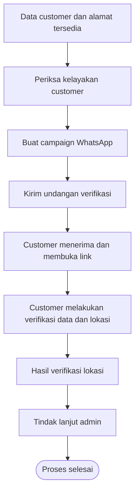
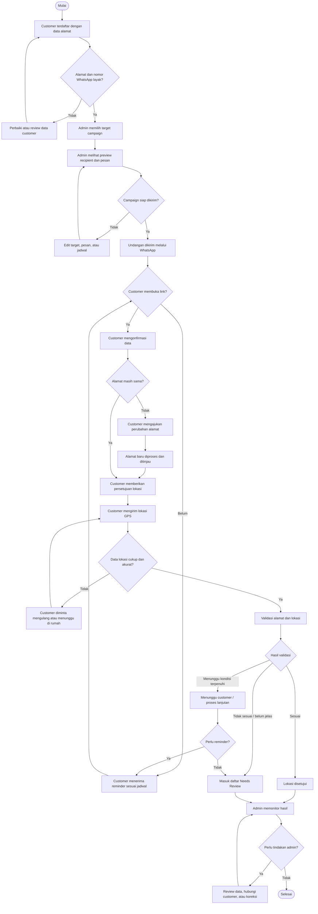
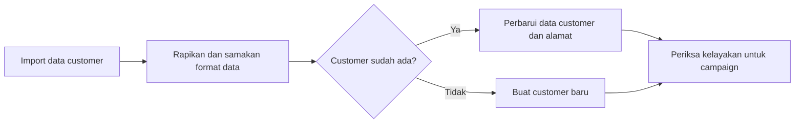
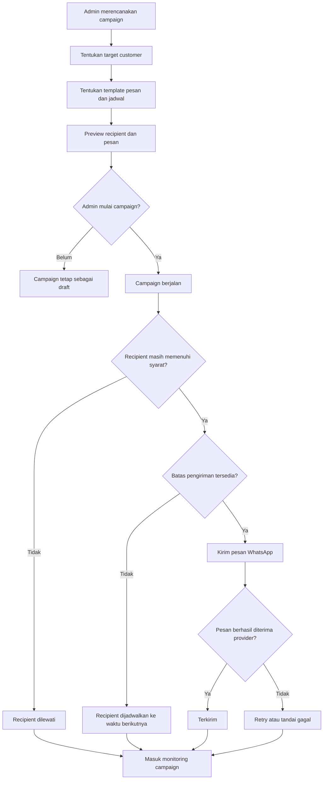
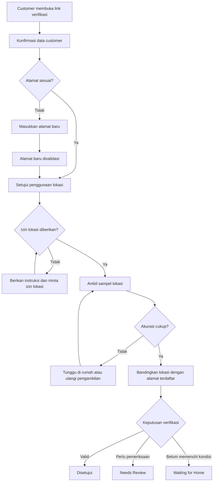
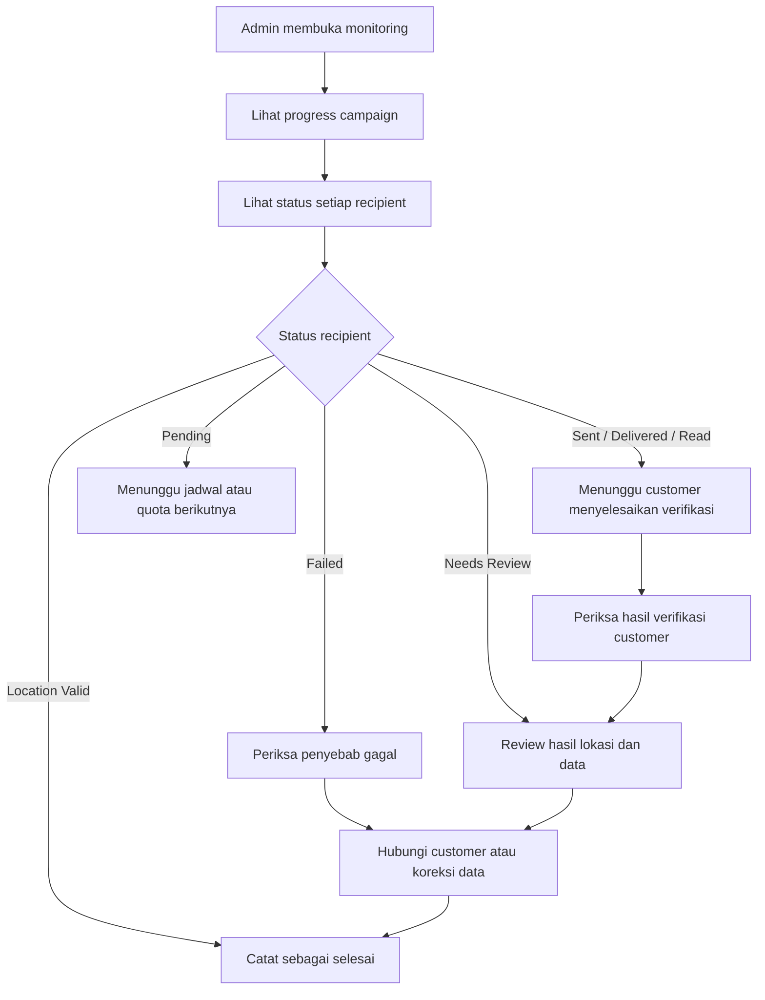

# Business Flow IRA Preregist

Dokumen ini menjelaskan alur bisnis aplikasi dari persiapan data customer sampai hasil verifikasi lokasi.

## 1. Gambaran besar

## 2. Flow bisnis end-to-end

## 3. Flow pengelolaan data customer

Customer yang dapat dipilih untuk campaign adalah customer yang memenuhi aturan bisnis, antara lain memiliki nomor WhatsApp yang dapat digunakan, belum opt-out, dan memiliki alamat yang perlu diverifikasi.

## 4. Flow campaign WhatsApp

## 5. Flow customer verifikasi lokasi

## 6. Arti hasil bisnis

| Hasil | Arti bisnis | Tindakan berikutnya |
|---|---|---|
| `LOCATION_VALID` | Alamat dan lokasi customer memenuhi aturan verifikasi | Proses dapat dianggap berhasil |
| `NEEDS_REVIEW` / `MANUAL_REVIEW` | Hasil belum dapat disetujui otomatis atau terdapat ketidaksesuaian | Reviewer memeriksa data dan evidence |
| `WAITING_FOR_HOME` | Customer belum berada di lokasi rumah atau perlu mencoba lagi | Customer dapat menunggu dan menerima reminder |
| `LOW_GPS_ACCURACY` | Sinyal GPS belum cukup akurat | Customer diarahkan mengulang pengambilan lokasi |
| `ADDRESS_PROPOSED` | Customer mengusulkan perubahan alamat | Alamat baru perlu diproses sebelum keputusan akhir |
| `SENT` | Undangan berhasil diterima oleh provider WhatsApp | Menunggu customer membuka link |
| `FAILED` | Pengiriman tidak berhasil setelah percobaan yang tersedia | Admin memeriksa penyebab atau melakukan tindak lanjut |
| `OPTED_OUT` | Customer tidak ingin menerima pesan WhatsApp | Customer tidak dikirimi campaign berikutnya |

## 7. Flow monitoring dan tindak lanjut admin

## 8. Kondisi selesai

Proses customer dianggap selesai apabila:

1. lokasi telah berstatus valid; atau
2. reviewer telah menyelesaikan pemeriksaan manual; atau
3. customer dinyatakan tidak dapat diproses lebih lanjut karena gagal, opt-out, atau data tidak valid.

Campaign dianggap selesai apabila seluruh recipient sudah berada pada status akhir atau sudah dijadwalkan untuk proses lanjutan yang disepakati.
