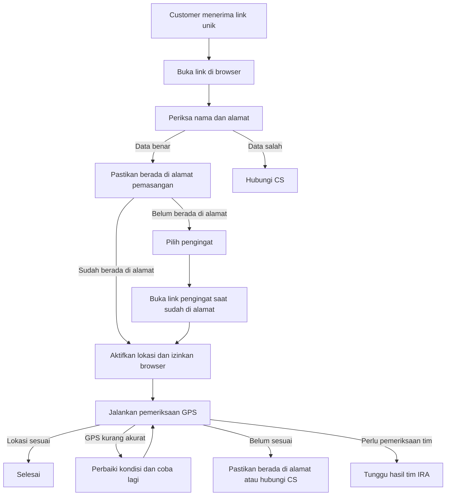

# Panduan Customer: Verifikasi Alamat dan Lokasi melalui Link Unik

Dokumen ini digunakan oleh tim Customer Service (CS) untuk menjelaskan proses kepada customer yang menerima link unik pemeriksaan alamat dan lokasi pemasangan.

## 1. Tujuan proses

Customer diminta melakukan pemeriksaan singkat untuk memastikan bahwa:

- data nama dan alamat yang terdaftar benar;
- customer memang berada di alamat pemasangan;
- titik lokasi dari HP sesuai dengan alamat pemasangan.

Customer tidak perlu menginstal aplikasi tambahan. Proses dilakukan melalui browser di HP menggunakan link unik yang dikirim melalui WhatsApp.

## 2. Hal yang perlu disiapkan customer

Sebelum membuka link, minta customer menyiapkan:

1. HP dengan koneksi internet yang stabil.
2. Browser seperti Google Chrome atau Safari.
3. Fitur **Lokasi / Location** pada HP dalam keadaan aktif.
4. Customer berada di alamat pemasangan saat melakukan pemeriksaan lokasi.
5. Waktu sekitar 2–5 menit untuk menyelesaikan proses.

Jika customer belum berada di alamat pemasangan, customer dapat memilih pengingat untuk melanjutkan nanti.

## 3. Peringatan keamanan link

Link yang dikirim adalah link unik untuk satu customer dan satu proses pemeriksaan.

- Jangan meneruskan atau membagikan link kepada orang lain.
- Jangan meminta customer mengirimkan link tersebut ke CS melalui grup atau media sosial.
- Jangan meminta password, PIN, atau kode OTP karena proses ini tidak memerlukan password atau OTP customer.
- Jika customer merasa link bukan berasal dari IRA atau data yang muncul bukan miliknya, customer tidak boleh menekan tombol konfirmasi. Arahkan customer untuk menghubungi CS.
- Masa berlaku link dapat dilihat pada halaman pemeriksaan. Jika sudah kedaluwarsa, CS perlu mengirimkan link baru melalui proses resmi.

## 4. Template pesan WhatsApp untuk customer

CS dapat menyalin dan menyesuaikan template berikut.

```text
Halo Bapak/Ibu {NAMA CUSTOMER},

Kami dari IRA ingin melakukan pemeriksaan alamat dan lokasi pemasangan Anda.

Mohon ikuti langkah berikut:
1. Buka link unik yang dikirim pada pesan ini.
2. Periksa nama dan alamat yang tampil.
3. Jika data benar, tekan “Ya, data saya benar”.
4. Saat diminta, izinkan akses lokasi pada browser.
5. Pastikan Anda berada di alamat pemasangan, lalu diam di tempat sampai pemeriksaan selesai.

Penting:
- Aktifkan fitur Lokasi/Location pada HP.
- Gunakan koneksi internet yang stabil.
- Jangan membagikan link ini kepada orang lain.

Jika belum berada di alamat pemasangan, pilih “Ingatkan saya nanti” dan tentukan waktu pengingat.

Link pemeriksaan Anda:
{LINK UNIK}

Terima kasih.
``` 

## 5. Panduan langkah demi langkah untuk customer

### Langkah 1 — Buka link unik

Customer mengetuk link yang diterima melalui WhatsApp. Link akan membuka halaman **Verifikasi Lokasi** di browser.

Jika halaman tidak terbuka:

- salin link dan buka di Google Chrome atau Safari;
- pastikan koneksi internet aktif;
- jangan mengubah atau memotong bagian link;
- jika muncul pesan link tidak valid atau kedaluwarsa, hubungi CS untuk meminta link baru.

### Langkah 2 — Periksa data customer

Halaman akan menampilkan nama, nomor telepon, dan rincian alamat pemasangan.

Customer perlu memeriksa terutama:

- provinsi;
- kota atau kabupaten;
- kecamatan;
- kelurahan atau desa;
- nama jalan atau perumahan;
- nomor rumah dan detail alamat jika tersedia.

Jika benar, tekan **“Ya, data saya benar”**.

Jika data bukan milik customer atau sangat berbeda, tekan **“Data saya berbeda”** dan hubungi CS. Customer tidak boleh melanjutkan menggunakan link milik orang lain.

### Langkah 3 — Pastikan berada di alamat pemasangan

Pemeriksaan lokasi harus dilakukan saat customer berada di alamat pemasangan.

Jika customer belum berada di lokasi:

1. Tekan **“Ingatkan saya nanti”**.
2. Pilih tanggal dan waktu pengingat.
3. Buka link pengingat baru saat sudah berada di alamat pemasangan.

Pengingat dikirim melalui WhatsApp sesuai jadwal. Sistem membatasi jumlah pengingat untuk satu pemeriksaan.

### Langkah 4 — Aktifkan lokasi HP

Saat browser menampilkan permintaan akses lokasi, customer harus memilih **“Izinkan” / “Allow”**.

Jika permintaan izin tidak muncul:

1. Buka Settings/Pengaturan HP.
2. Aktifkan **Location/Lokasi**.
3. Aktifkan **Precise Location/Lokasi Presisi** jika tersedia.
4. Buka pengaturan izin aplikasi untuk browser yang digunakan.
5. Izinkan browser mengakses lokasi, lalu kembali ke halaman pemeriksaan.
6. Tekan **“Izinkan lokasi & mulai”** atau tombol coba lagi.

### Langkah 5 — Jalankan pemeriksaan GPS

Setelah izin diberikan:

- berada di area terbuka atau dekat jendela;
- jangan berpindah tempat selama proses berlangsung;
- pastikan lokasi HP tetap aktif;
- tunggu sampai pemeriksaan selesai, biasanya hingga sekitar 30 detik;
- jangan menutup browser atau memuat ulang halaman selama pemeriksaan.

Sistem akan mengambil dan memilih data lokasi terbaik dari perangkat customer.

### Langkah 6 — Baca hasil pemeriksaan

Hasil yang muncul dapat berupa:

| Hasil pada halaman | Penjelasan untuk customer | Tindakan customer |
|---|---|---|
| **Lokasi sudah sesuai** | Alamat dan lokasi pemasangan sudah cocok. | Tidak perlu melakukan apa-apa lagi. |
| **Lokasi belum terbaca dengan jelas** | Sinyal GPS belum cukup kuat atau stabil. Ini tidak otomatis berarti alamat salah. | Aktifkan lokasi, pindah ke area terbuka/dekat jendela, diam di tempat, lalu coba lagi. |
| **Lokasi belum sesuai** | Lokasi HP belum cocok dengan alamat pemasangan, biasanya karena customer belum berada di alamat tersebut. | Pastikan berada di alamat pemasangan, lalu ulangi pemeriksaan. |
| **Lokasi belum dapat dipastikan** | Sistem belum memperoleh data lokasi yang cukup jelas. | Coba kembali saat berada di alamat pemasangan. |
| **Lokasi sedang diperiksa tim** | Data lokasi sudah diterima dan sedang diperiksa secara manual. | Tidak perlu mengulang. Tunggu informasi dari tim IRA. |
| **Data alamat belum cocok** | Data yang dipilih belum cocok dengan pemeriksaan. | Hubungi CS untuk memperbaiki atau mengonfirmasi alamat. |
| **Alamat baru sudah dikirim** | Customer mengajukan perubahan alamat dan alamat baru menunggu pemeriksaan lokasi. | Pastikan alamat baru benar, lalu lakukan pemeriksaan lokasi pada alamat tersebut. |

## 6. Jika alamat customer sudah berubah

Customer dapat menekan **“Alamat saya sudah berubah”** jika alamat terdaftar sudah tidak sesuai.

Customer perlu mengisi alamat terbaru dengan benar. Field utama yang wajib diisi:

- provinsi;
- kota/kabupaten;
- kecamatan;
- kelurahan/desa;
- nama jalan atau perumahan.

Field yang dapat dikosongkan jika memang tidak tersedia:

- nomor rumah;
- kode pos;
- detail alamat.

Namun, CS sebaiknya tetap meminta customer mengisi nomor rumah dan patokan jika tersedia agar alamat lebih mudah diverifikasi.

### Panduan mengisi nama jalan

Jika customer tidak yakin dengan nama jalan:

1. Buka Google Maps.
2. Cari alamat rumah atau tekan titik biru lokasi saat berada di rumah.
3. Ketuk nama jalan yang tampil.
4. Salin atau tulis nama tersebut ke kolom **Nama jalan / perumahan**.
5. Tambahkan patokan pada kolom detail alamat jika nama jalan tidak jelas.

Setelah alamat dikirim, customer tetap perlu melakukan pemeriksaan GPS di alamat baru.

### 6.1 Jika alamat sudah diisi benar tetapi hasil masih belum cocok

Jelaskan kepada customer bahwa **alamat yang ditulis benar belum tentu langsung menghasilkan lokasi yang cocok**. Sistem memeriksa dua hal yang berbeda:

1. **Isi alamat** — apakah provinsi, kota/kabupaten, kecamatan, kelurahan/desa, dan nama jalan sudah benar.
2. **Posisi GPS saat pemeriksaan** — apakah HP customer benar-benar berada di sekitar alamat pemasangan dan sinyal lokasinya cukup akurat.

Karena itu, customer dapat melihat hasil belum cocok walaupun merasa alamatnya sudah benar. Penyebab yang umum adalah:

- customer belum berada di alamat pemasangan saat menekan tombol pemeriksaan;
- lokasi HP masih membaca posisi sebelumnya atau belum stabil;
- izin **Lokasi Presisi** belum aktif;
- customer berada di dalam bangunan dengan sinyal GPS yang lemah;
- titik referensi alamat di peta belum tepat atau belum cukup presisi;
- nama jalan terbaca berbeda oleh peta, misalnya singkatan atau variasi penulisan.

#### Edukasi yang harus diberikan CS

Sampaikan bahwa customer **tidak perlu mengubah alamat yang sebenarnya benar hanya untuk memaksa hasil menjadi cocok**. Minta customer mengikuti urutan berikut:

1. Pastikan benar-benar berada di alamat pemasangan.
2. Aktifkan Location/Lokasi dan **Lokasi Presisi**.
3. Gunakan koneksi internet yang stabil.
4. Berada di area terbuka atau dekat jendela.
5. Tekan tombol **Coba verifikasi lokasi lagi**.
6. Diam di tempat dan tunggu pemeriksaan selesai, hingga sekitar 30 detik.

#### Cara membedakan pesan hasil

| Pesan yang dilihat customer | Maksudnya | Edukasi CS |
|---|---|---|
| **Lokasi belum terbaca dengan jelas** | Masalah utama ada pada kualitas atau kestabilan GPS. | Ini belum berarti alamat salah. Perbaiki kondisi GPS lalu coba lagi. |
| **Lokasi belum sesuai** | Posisi GPS belum cocok dengan alamat atau titik referensi yang tersimpan. | Pastikan berada di alamat pemasangan dan ulangi sekali lagi. |
| **Lokasi belum dapat dipastikan** | Sistem belum memperoleh bukti lokasi yang cukup. | Coba saat berada di lokasi dengan sinyal GPS lebih baik. |
| **Lokasi sedang diperiksa tim** | Data GPS sudah diterima dan menunggu pemeriksaan manual. | Jangan mengulang. Tunggu hasil dari tim IRA. |
| **Data alamat belum cocok** | Ada informasi alamat atau hasil lokasi yang perlu dikonfirmasi. | Hubungi CS untuk review alamat; jangan mengganti data tanpa alasan yang benar. |

#### Jika setelah dicoba tetap belum cocok

Jika customer sudah berada di alamat yang benar, sudah mengaktifkan Lokasi Presisi, dan hasil tetap belum cocok:

- jangan meminta customer mengganti alamat dengan alamat yang salah;
- jangan meminta customer mengirim koordinat manual sebagai pengganti pemeriksaan;
- catat nama, nomor terdaftar, waktu percobaan, dan pesan hasil yang tampil;
- minta screenshot hasil jika diperlukan;
- eskalasikan ke tim Ops untuk memeriksa titik referensi alamat dan hasil GPS;
- jika sistem menampilkan **Sedang diperiksa tim**, customer cukup menunggu.

#### Script CS yang dapat digunakan

> Alamat yang Anda isi bisa saja sudah benar, tetapi sistem juga perlu memastikan posisi HP Anda berada di sekitar alamat tersebut. Mohon pastikan Anda sudah berada di alamat pemasangan, aktifkan Lokasi dan Lokasi Presisi, lalu lakukan pemeriksaan di area terbuka atau dekat jendela. Jangan mengubah alamat yang benar. Jika hasilnya tetap belum cocok, kami akan bantu periksa titik lokasi dan data alamatnya.

## 7. Penanganan kendala umum oleh CS

### A. Customer belum menerima WhatsApp

CS perlu memeriksa:

- nomor WhatsApp customer;
- status pengiriman pada menu Pengiriman WhatsApp;
- apakah pesan berstatus terkirim, gagal, atau masih menunggu;
- apakah customer melakukan opt-out.

Jangan langsung membuat link baru jika link sebelumnya masih aktif. Pastikan status pengiriman dan sesi pemeriksaan sudah diperiksa terlebih dahulu.

### B. Link tidak bisa dibuka

Instruksi untuk customer:

1. Pastikan link dibuka dari pesan WhatsApp terbaru.
2. Coba buka menggunakan Google Chrome atau Safari.
3. Pastikan seluruh link tersalin, termasuk karakter setelah tanda `/`.
4. Coba gunakan koneksi seluler atau Wi-Fi yang stabil.
5. Jika tetap muncul **Tautan tidak valid**, **Tautan kedaluwarsa**, atau halaman tidak dapat dimuat, CS memeriksa sesi dan mengirimkan link baru jika diperlukan.

### C. Izin lokasi ditolak

Instruksi untuk customer:

1. Aktifkan Location/Lokasi pada HP.
2. Buka pengaturan izin lokasi browser.
3. Ubah izin situs menjadi **Allow/Izinkan**.
4. Aktifkan lokasi presisi jika pilihan tersebut tersedia.
5. Kembali ke link dan tekan tombol coba lagi.

### D. GPS tidak akurat atau pemeriksaan berhenti

Instruksi untuk customer:

- pastikan berada di alamat pemasangan;
- pindah ke area terbuka atau dekat jendela;
- pastikan Location/Lokasi aktif;
- pastikan koneksi internet stabil;
- jangan bergerak selama pemeriksaan;
- tekan tombol **Coba verifikasi lokasi lagi**.

Jika customer sudah mencapai batas percobaan, jangan meminta customer mencoba berkali-kali. Arahkan customer memilih pengingat atau hubungi CS untuk tindak lanjut.

### E. Customer sedang tidak berada di rumah

Arahkan customer memilih **“Ingatkan saya nanti”**. Customer tidak perlu memaksakan pemeriksaan dari lokasi lain karena hasilnya dapat tidak sesuai dengan alamat pemasangan.

Customer harus membuka link pengingat baru ketika sudah berada di alamat pemasangan.

### F. Customer melihat “Sedang diperiksa tim”

Jelaskan bahwa data lokasi sudah diterima dan sedang diperiksa oleh tim IRA. Customer tidak perlu mengulang proses kecuali diminta oleh CS atau tim operasional.

### G. Customer melihat “Data alamat belum cocok”

Jangan menjanjikan bahwa pemeriksaan akan langsung disetujui. Minta customer menghubungi CS untuk:

- mengonfirmasi alamat;
- mengajukan alamat terbaru jika memang sudah berubah;
- memberikan patokan atau detail lokasi yang membantu pemeriksaan.

### H. Customer salah menekan tombol

Jika customer menekan tombol yang salah, minta customer tidak mengulang secara sembarangan. CS memeriksa status sesi terlebih dahulu. Customer tetap menggunakan link yang sama selama link masih berlaku, kecuali CS mengirim link baru.

### I. Customer melihat “Pengingat sudah dipilih”

Artinya customer sudah memilih jadwal pengingat sebelumnya. Customer tidak perlu memilih pengingat lagi.

Instruksi untuk customer:

- tunggu sampai link pengingat baru dikirim melalui WhatsApp;
- buka link pengingat terbaru saat sudah berada di alamat pemasangan;
- jangan menggunakan link dari customer lain.

Jika customer sudah berada di alamat dan halaman menyediakan tombol untuk memulai pemeriksaan, customer dapat melanjutkan dari tombol tersebut.

### J. Batas percobaan GPS atau reminder sudah tercapai

Sistem membatasi percobaan pemeriksaan lokasi dan jumlah reminder untuk satu sesi. Jika customer melihat pesan bahwa batas sudah tercapai:

- jangan meminta customer menekan tombol berulang kali;
- periksa status sesi melalui dashboard admin;
- jika masih ada pilihan reminder, arahkan customer memilih jadwal yang tersedia;
- jika seluruh batas sudah habis, lanjutkan melalui CS/Ops untuk pemeriksaan dan tindak lanjut manual.

### K. Alamat wajib belum lengkap

Jika customer diminta melengkapi alamat, field utama yang wajib diisi adalah provinsi, kota/kabupaten, kecamatan, kelurahan/desa, dan nama jalan/perumahan.

Nomor rumah, kode pos, dan detail alamat dapat dikosongkan jika memang tidak tersedia, tetapi sebaiknya diisi apabila customer mengetahuinya. Customer harus mengirim alamat yang benar sebelum melanjutkan pemeriksaan lokasi.

### L. Link pengingat baru sudah diterima

Jika halaman menampilkan bahwa link pengingat baru sudah diterima:

1. Pastikan customer sudah berada di alamat pemasangan.
2. Aktifkan Location/Lokasi dan Lokasi Presisi.
3. Tekan **“Saya sudah di alamat, mulai verifikasi”**.
4. Izinkan browser mengakses lokasi jika diminta.
5. Diam di tempat sampai pemeriksaan selesai.

### M. Halaman ter-refresh atau customer menutup browser

Customer dapat membuka kembali link yang sama selama link masih berlaku. Status proses tersimpan pada sesi pemeriksaan. Jika halaman meminta langkah yang berbeda dari sebelumnya, ikuti status terbaru yang tampil dan jangan membuka link milik customer lain.

## 8. Script percakapan CS

### Saat customer bertanya tujuan link

> Link tersebut digunakan untuk memastikan data alamat dan lokasi pemasangan Anda. Proses dilakukan melalui browser HP dan membutuhkan izin lokasi agar sistem dapat mencocokkan posisi Anda dengan alamat yang terdaftar.

### Saat customer bertanya apakah aman

> Link dibuat khusus untuk proses pemeriksaan Anda. Mohon jangan membagikan link tersebut kepada orang lain. Kami hanya meminta izin lokasi saat pemeriksaan berlangsung dan tidak meminta password atau OTP.

### Saat customer belum berada di rumah

> Tidak masalah. Silakan pilih “Ingatkan saya nanti” pada halaman tersebut. Pilih waktu pengingat, kemudian buka link pengingat yang dikirim melalui WhatsApp saat Anda sudah berada di alamat pemasangan.

### Saat lokasi tidak cocok

> Hasil tersebut belum tentu berarti alamat Anda salah. Pastikan Anda berada di alamat pemasangan, aktifkan lokasi presisi, berada di area terbuka atau dekat jendela, lalu coba pemeriksaan kembali tanpa berpindah tempat.

### Saat customer sudah selesai

> Terima kasih, data lokasi Anda sudah diterima. Jika hasilnya memerlukan pemeriksaan tim, Anda tidak perlu mengulang proses. Tim IRA akan memproses hasilnya dan menghubungi Anda jika diperlukan.

## 9. Informasi yang boleh diminta CS

Jika terjadi kendala, CS boleh meminta:

- nama customer;
- nomor WhatsApp yang terdaftar;
- ID customer jika tersedia;
- waktu customer mencoba membuka link;
- jenis HP dan browser yang digunakan;
- pesan error yang muncul;
- screenshot pesan error, dengan memastikan informasi sensitif tidak ikut tersebar.

CS tidak perlu meminta customer mengirim koordinat manual. Lokasi harus dikirim melalui halaman pemeriksaan agar tercatat pada sesi yang benar.

## 10. Checklist CS sebelum menutup percakapan

- [ ] Customer membuka link unik yang benar.
- [ ] Customer memeriksa nama dan alamat.
- [ ] Customer berada di alamat pemasangan saat melakukan pemeriksaan.
- [ ] Location/Lokasi HP aktif.
- [ ] Izin lokasi browser sudah diizinkan.
- [ ] Customer sudah menunggu sampai pemeriksaan selesai.
- [ ] Customer memahami hasil yang tampil.
- [ ] Jika perlu reminder, customer sudah memilih jadwal.
- [ ] Jika alamat berubah, customer sudah diarahkan mengisi alamat terbaru.
- [ ] Customer diingatkan untuk tidak membagikan link unik.

## 11. Matriks singkat semua case

| Kondisi | Respons CS |
|---|---|
| Link valid, data benar, belum mulai | Arahkan customer konfirmasi data dan lanjutkan. |
| Data bukan milik customer | Jangan lanjutkan; minta customer hubungi CS. |
| Alamat berubah | Isi alamat terbaru dan lakukan pemeriksaan GPS di alamat baru. |
| Belum berada di rumah | Pilih reminder dan buka link baru saat sudah di lokasi. |
| Izin lokasi ditolak | Aktifkan lokasi, izinkan browser, lalu coba lagi. |
| GPS kurang akurat | Area terbuka/dekat jendela, diam di tempat, lalu ulangi. |
| Lokasi belum sesuai | Pastikan berada di alamat pemasangan dan ulangi. |
| Lokasi belum dapat dipastikan | Coba lagi saat berada di alamat pemasangan. |
| Pengingat sudah dipilih | Tunggu link pengingat baru; jangan membuat pilihan berulang. |
| Batas percobaan/reminder tercapai | Periksa dashboard dan lanjutkan ke CS/Ops. |
| Lokasi sedang diperiksa tim | Customer tidak perlu mengulang; tunggu hasil tim. |
| Lokasi sudah sesuai | Proses customer selesai. |
| Data alamat belum cocok | Hubungi CS untuk koreksi atau review alamat. |
| Link invalid/kedaluwarsa | Validasi sesi dan kirim link baru jika diperlukan. |
| Halaman error/refresh | Coba buka ulang link yang sama; eskalasi jika tetap gagal. |

## 12. Ringkasan alur



Dokumen ini menjadi panduan komunikasi CS. Keputusan akhir pemeriksaan tetap mengikuti hasil sistem dan proses review tim IRA.
